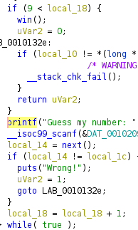

# Randomization 1


The challenge is to somehow predict the random numbers the binary is generating.

Decompilation of main in ghidra shows that we need to predict the next number 10 times.



The next random number is generated from the `next` function.

When you decompile that function in ghidra, you can see it's a simple pseudorandom function.


We can easily implement this in python.

```python
n = (n * ord('%') + 0x41) % 256 ## pseudorandom function
```

We can connect to the server using pwntools, leak the first number, and send 10 numbers using the pseudorandom function to get the flag.

Flag: `flag{l1n34r_c0n6ru3n714l_63n3r470r_f41lur3_4b3bcd43}`
