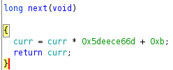

# Randomization 2


This challenge is basically the same thing as the first randomization challenge, but with a different pseudorandom function.

We can decompile the pseudorandom function again using ghdra:



We just have to implement this in our python script that we used earlier in the last challenge to get the flag.

```python
n = (n * 0x5deece66d + 0xb) % (2 ** 64) ## yet another simple pseudorandom function
```

```
$ py sol.py rem
[+] Opening connection to crypto.hsctf.com on port 6002: Done
14084126384527245532
[*] Switching to interactive mode
Guess my number: Guess my number: Guess my number: Guess my number: Guess my number: Guess my number: Guess my number: Guess my number: Guess my number: Guess my number: You win!
Have a flag: flag{1n53cur3_r4nd0m_46b8861b}

[*] Got EOF while reading in interactive
$
```

Flag: `flag{1n53cur3_r4nd0m_46b8861b}`
