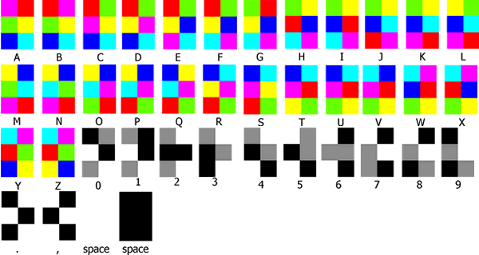
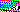

# Rainbow Vomit

We are given this image:


It's a very small image, and it seems there's a hidden message in it. We just don't know what encoding the image uses.

There was a hint that the type of encoding of the image was invented by Josh Cramer, and someone on my team figured out that it uses the hexahue alphabet.

[](https://www.omniglot.com/conscripts/hexahue.php)

All we need to do is decode the image to get the flag.

I thought that it would be very time consuming to decode all the chars by hand, so I decided to make a script to do so.

My script loops through all 2x3 blocks of the image, and compares it to another image, which is just the hexahue alphabet but pixel by pixel:



I used GIMP to remove the white sides from the image, and one of my team members friends spent the time to draw (pixel by pixel) the whole hexahue alphabet, and made sure it uses the same colors as the challenge flag. (thanks for that btw)

It took a bit of debugging, but I made a fully functioning script that can decode any hexahue image you give it! You can see it [here](sol.py).

```
$ py sol.py
```

Output:

THERE IS SUCH AS THING AS A TOMCAT BUT HAVE YOU EVER HEARD OF A TOMDOG. THIS IS THE MOST IMPORTANT QUESTION OF OUR TIME, AND UNFORTUNATELY ONE THAT MAY NEVER BE ANSWERED BY MODERN SCIENCE. THE DEFINITION OF TOMCAT IS A MALE CAT, YET THE NAME FOR A MALE DOG IS MAX. WAIT NO. THE NAME FOR A MALE DOG IS JUST DOG. REGARDLESS, WHAT WOULD HAPPEN IF WE WERE TO COMBINE A MALE DOG WITH A TOMCAT. PERHAPS WED END UP WITH A DOG THAT VOMITS OUT FLAGS, LIKE THIS ONE RTCP SHOULD,FL5G4,B3,ST1CKY,OR,N0T

Flag: `rtcp{should,fl5g4,b3,st1cky,or,n0t}`
