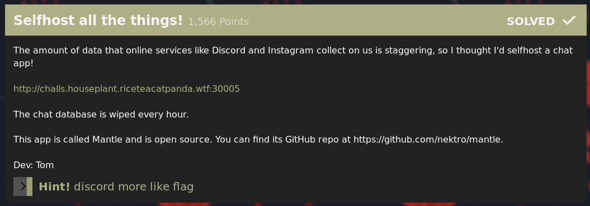
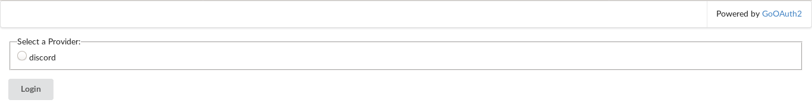
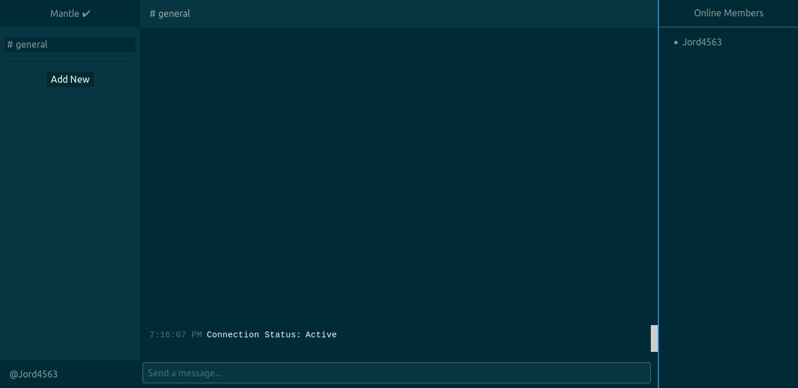
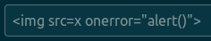
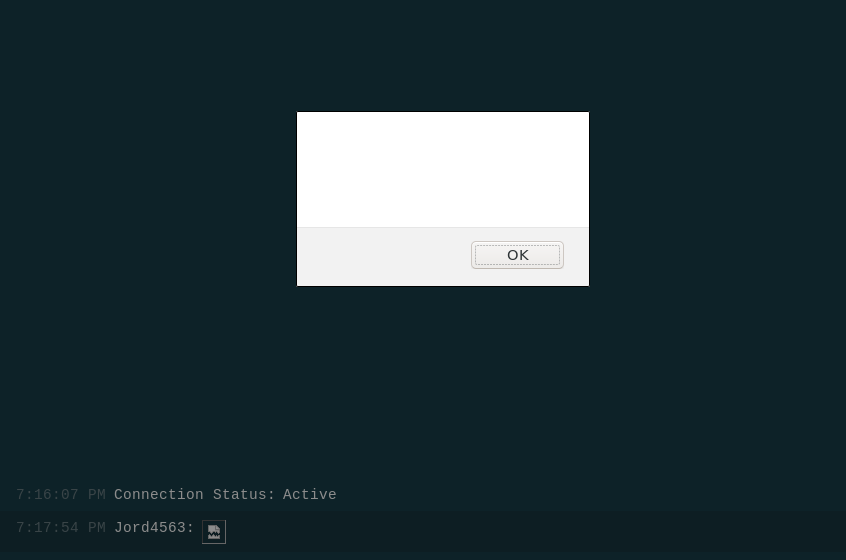
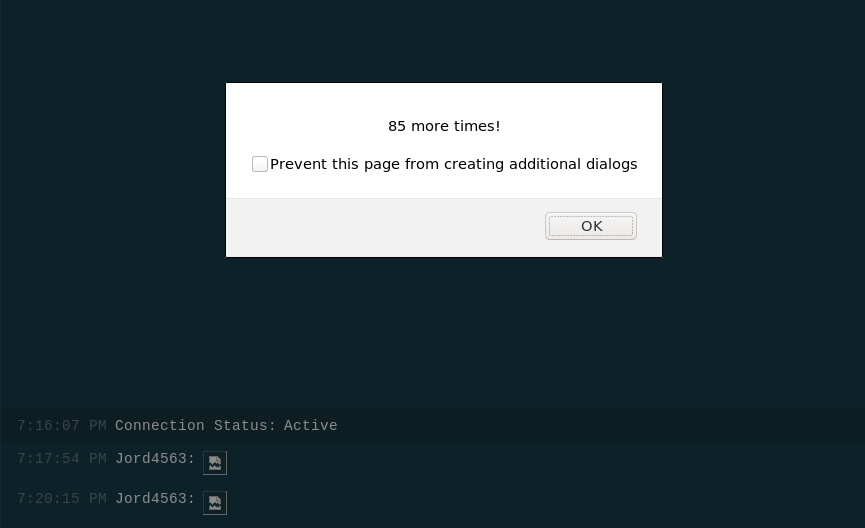
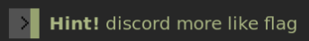
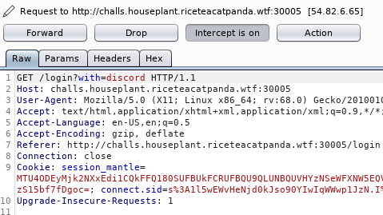
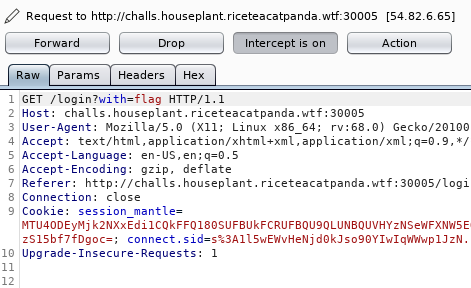
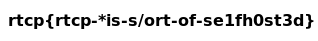

# Selfhost all the things!



When logging in to mantle, you are given one option, discord.



When you log in, you are given a simple chat application:



I did find some XSS vulns, but it doesn't seem too useful:





I actually did have a bit of fun with it though! :joy:

```html
 0; i--) { alert(`${i} more times!`) }; alert('Good job :)');">
```



Unfortunately, that wasn't it. Time to keep searching.

There was a hint that came with the challenge:



Maybe if we login with flag instead of discord, it will give us the flag?

Let's try it.

I edited the request headers with burp, and I just changed the `with` parameter from `discord` to `flag`.




And sure enough, when we forward the request, we get the flag!



Flag: `rtcp{rtcp-*is-s/ort-of-se1fh0st3d}`
