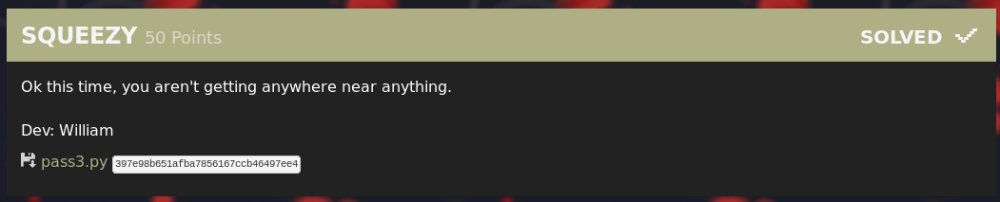

# SQUEEZY



This is the last challenge of a 4-part series: `EZ PZ LEMON SQUEEZY`

And turns out, it is easy peasy lemon squeezy!

We are given a [python script](pass3.py). It asks for a password, and if you get it wrong, well you'll have to deal with this:

```
$ py pass3.py
Enter the password: no
Incorrect password!
sowwy but now you gunnu have to listen to me spweak in cat giwrl speak uwu~
pwease enter youwr password... uwu~ nya!!: nooooooo
sowwy but that wasnt quite rwight nya~... pwease twy again
pwease enter youwr password... uwu~ nya!!:
```

Let's reverse engineer it!

```python
def checkpass():
  userinput = input("Enter the password: ")
  key = "meownyameownyameownyameownyameownya"
  a = woah(key,userinput)
  b = str.encode(a)
  result = base64.b64encode(b, altchars=None)
  if result == b'HxEMBxUAURg6I0QILT4UVRolMQFRHzokRBcmAygNXhkqWBw=':
      return True
  else:
      return False
```

It takes a password as input, then does a bunch of stuff with it, and if the result is `b'HxEMBxUAURg6I0QILT4UVRolMQFRHzokRBcmAygNXhkqWBw='` you have the right password.

Let's do this in reverse! The end result is base64 decoded:

```python
result = base64.b64encode(b, altchars=None)
```

To do the reverse, we decode it with base64.

```python
from base64 import *

encPass = b'HxEMBxUAURg6I0QILT4UVRolMQFRHzokRBcmAygNXhkqWBw='
part = b64decode(encPass)
```

We do the same thing with the next bit: do the reverse!

```python
b = str.encode(a)
```

```python
part = part.decode()
```

We have a new function `woah()`:

```python
a = woah(key,userinput)
```

`woah` just performs a bitwise `xor`  with both operands.

```python
def woah(s1,s2):
    return ''.join(chr(ord(a) ^ ord(b)) for a,b in zip(s1,s2))
```

And because we have the key:

```python
key = "meownyameownyameownyameownyameownya"
```

...we can decrypt it!

```python
def woah(s1,s2):
    return ''.join(chr(ord(a) ^ ord(b)) for a,b in zip(s1,s2))

key = "meownyameownyameownyameownyameownya"
flag = woah(part, key)

print(flag)
```

Flag: `rtcp{y0u_L3fT_y0uR_x0r_K3y_bEh1nD!}`
