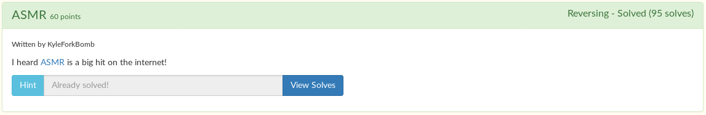
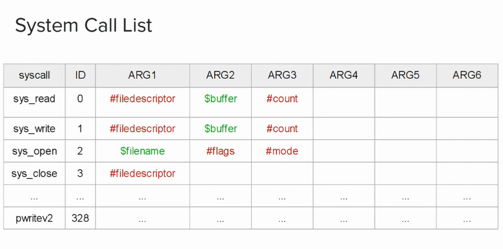
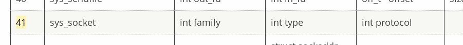
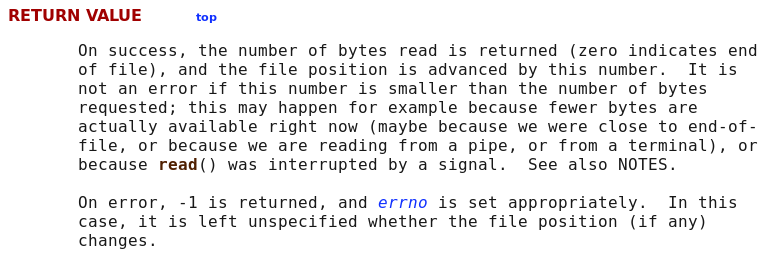

# ASMR



Alright, this was a really fun assembly reversing challenge. If you don't know much about x86 or x86_64 assembly, I would highly recommend [watching these tutorials](https://www.youtube.com/playlist?list=PLetF-YjXm-sCH6FrTz4AQhfH6INDQvQSn). The first tutorial teaches you how to compile assembly code using nasm.

We are given the [assembly source](asmr.asm) of the binary. You can compile it like so:

```
sudo apt-get install nasm
nasm -f elf64 -o asmr.o asmr.asm
ld asmr.o -o asmr
```

The first thing I noticed was that there are a lot of different system calls I don't even know about.

```
mov	rax, 0x29
mov	rdi, 0x02
mov	rsi, 0x01
mov	rdx, 0x00
syscall
```

The ID of a system call is stored in rax. I already knew four of from the tutorial above, but I didn't know about any others. Here's some basic ones for you:

[](https://youtu.be/BWRR3Hecjao)

I found a table with [all the linux system calls](https://blog.rchapman.org/posts/Linux_System_Call_Table_for_x86_64/) online after some searching. I know that the system call ID is stored in `rax`, so I converted hex `0x29` to decimal form, and looked up the code on the site.

[](https://blog.rchapman.org/posts/Linux_System_Call_Table_for_x86_64/)

Looks like the program creates a socket. I ran `strace` on the executable to see what port it's running on.

```
$ strace ./asmr
execve("./asmr", ["./asmr"], 0x7ffefc3d90d0 /* 42 vars */) = 0
socket(AF_INET, SOCK_STREAM, IPPROTO_IP) = 3
setsockopt(3, SOL_SOCKET, SO_REUSEADDR, "\1\0\0\0\0\0\0\0", 8) = 0
bind(3, {sa_family=AF_INET, sin_port=htons(1337), sin_addr=inet_addr("0.0.0.0")}, 16) = 0
listen(3, 1)                            = 0
accept(3, NULL, NULL
```

Looks like it's running on port 1337. Nice.

If you aren't using strace, you can just as easily reverse the assembly code to see what port it's running on. See code below.

```
main:
	push	rbp
	mov	rbp, rsp
	sub	rsp, 0x50
	mov	rax, 0x29 ## sys_socket
	mov	rdi, 0x02
	mov	rsi, 0x01
	mov	rdx, 0x00
	syscall ## create socket
	mov	QWORD [rbp-0x10], rax
	mov	rax, 0x36 ## sys_setsockopt
	mov	rdi, QWORD [rbp-0x10]
	mov	rsi, 0x01
	mov	rdx, 0x02
	mov	QWORD [rbp-0x50], 0x01
	lea	r10, [rbp-0x50]
	mov	r8, 0x08
	syscall
	mov	rax, 0x31 ## sys_bind
	mov	rdi, QWORD [rbp-0x10]
	push	0x00
	mov	bx, 0x0539 ## port 1337
	xchg	bh, bl
	shl	ebx, 0x10
	mov	bx, 0x02
	push	rbx
	mov	rsi, rsp
	add	rsp, 0x10
	mov	rdx, 0x10
	syscall
	mov	rax, 0x32 ## sys_listen
	mov	rsi, 0x01
	syscall
	mov	rax, 0x2b ## sys_accept
	mov	rsi, 0x00
	mov	rdx, 0x00
	syscall
```

I went ahead and connected to the port using nc, while the executable was running.

```
jordan@notyourcomputer:~$ nc 0.0.0.0 1337
Enter password:
```

It looks like it's asking for a password. What's next?

Well, let's keep dissecting the code.

I fond out that the next bit of code just sends out `Enter password: ` to the socket. It stores the hex bytes of each character on the stack, and then calls `sys_write` with the pointer to the string in `rsi` and the pointer to the socket in `rdi`

```
mov	QWORD [rbp-0x08], rax
mov	rbx, 0x6170207265746e45 ## Enter pa
mov	QWORD [rbp-0x50], rbx
mov	rbx, 0x203a64726f777373 ## ssword:
mov	QWORD [rbp-0x48], rbx
mov	rax, 0x01 ## sys_write
mov	rdi, QWORD [rbp-0x08]
lea	rsi, [rbp-0x50]
mov	rdx, 0x10
syscall ##  Write "Enter password: " to socket
```

The next piece of code reads 64 bytes of user input.

```
mov	rax, 0x00 ## sys_read
lea	rsi, [rbp-0x50] ## Huh? We are overwriting the "Enter password: " string!
					   ## Must be being reused to store input from user
					   ## It is stored 80 bytes below the base pointer
					   ## [rbp-0x50] is where the inputted password is stored
mov	rdx, 0x40 ## read 64 bytes of data
syscall ## get the data!
```

This is where I got confused for a bit.

```
cmp	rax, 0x11
jne	label5
```

`rax` has to be equal to `0x11`, or else the program jumps to `label5`.

Looking at the code in `label5`, all it does is send out `Nope!\n` to the socket.

```
label5: ## Password is incorrect if program jumps here
	mov	rbx, 0x0a2165706f4e ## "Nope!\n"
	mov	QWORD [rbp-0x50], rbx
	mov	rax, 0x01 ## sys_write
	mov	rdi, QWORD [rbp-0x08]
	lea	rsi, [rbp-0x50]
	mov	rdx, 0x06
	syscall ## write "Nope!\n" to socket
```

I'm assuming that means that the password is incorrect. That means that whenever the program jumps to `label5` the password is incorrect.

This is where I got confused. `rax` is set to `0x00` so the program can call `sys_read`, why the heck would it compare `rax` to `0x11` afterwards? We know that it's still zero, right?

Well, no. Apparently, system calls store their return value in `rax`. And `sys_read` returns the number of bytes read in `rax`.

[](https://www.man7.org/linux/man-pages/man2/read.2.html)

I know that the picture above is talking about C, but it's exactly the same for `sys_read`.

So this code...

```
cmp	rax, 0x11
jne	label5
```

...is checking if the password is 17 characters long. If it's not, then the password is incorrect.

```
cmp	rax, 0x11 ## password has to be 17 characters in length
jne	label5 ## jumping to label5 is a fail
```

The next bit of code checks if the 17th character is a line break. Okay then, the password is 16 characters, but still technically 17. Then, the code turns the line break into a null (so the string is null-terminated) and then starts the actual check.

```
lea	rax, [rbp-0x50] ## rax stores pointer of password (user input given)
cmp	BYTE [rax+16], 0x0a ## Again, password is 17 chars, why do you have to check it twice?
												## Well, it's technically 16 with a terminator (line break)
jne	label5
mov	BYTE [rax+16], 0x00 ## change that line break to a null
jmp	label2 ## start of actual check
```

Great! What's next?

For whatever reason, I decided to input 16 test characters into a program, and set a breakpoint in gdb, so I can analyze what it does.

```
(gdb) b *label1
Breakpoint 1 at 0x4010fe
(gdb) r
Starting program: /home/jordan/CTF-writeups/TJCTF2020/asmr/asmr

```

```
jordan@notyourcomputer:~$ nc 0.0.0.0 1337
Enter password: ABCDEFGHIJKLMNOP
```

```
Breakpoint 1, 0x00000000004010fe in label1 ()
(gdb)
```

Great! Now let's start debugging.

```
(gdb) x/100s $rax
0x7fffffffe160:	"ABCDEFGHIJKLMNOP"
...
(gdb) c
Continuing.

Breakpoint 1, 0x00000000004010fe in label1 ()
(gdb) x/100s $rax
0x7fffffffe161:	"BCDEFGHIJKLMNOP"
...
(gdb) x/100s $rax
0x7fffffffe162:	"CDEFGHIJKLMNOP"

```

Hm... Wonder what this does.

Looking at the code, it looks like it does a bitwise XOR with each of the chars of the password with 0x69:

```
label1:
	xor	BYTE [rax], 0x69 ## xor char with 0x69
	inc	rax ## increment pointer
label2:
	cmp	BYTE [rax], 0x00 ## loop through all chars (null terminated)
	jne	label1 ## continue at end of string
```

I added another breakpoint in label2 after the loop was over in gdb, and printed out the string to double check.

```
(gdb) disas label2
Dump of assembler code for function label2:
   0x0000000000401104 <+0>:	cmpb   $0x0,(%rax)
   0x0000000000401107 <+3>:	jne    0x4010fe <label1>
   0x0000000000401109 <+5>:	movabs $0x360c1f0605360c1e,%rax
   0x0000000000401113 <+15>:	cmp    %rax,-0x50(%rbp)
   0x0000000000401117 <+19>:	jne    0x401188 <label5>
   0x0000000000401119 <+21>:	movabs $0xc0c10361b041a08,%rax
   0x0000000000401123 <+31>:	cmp    %rax,-0x48(%rbp)
   0x0000000000401127 <+35>:	jne    0x401188 <label5>
   0x0000000000401129 <+37>:	movabs $0x402000,%rdi
   0x0000000000401133 <+47>:	lea    -0x50(%rbp),%rax
   0x0000000000401137 <+51>:	mov    $0x0,%ebx
   0x000000000040113c <+56>:	mov    $0x0,%ecx
   0x0000000000401141 <+61>:	mov    $0x0,%edx
   0x0000000000401146 <+66>:	jmp    0x401163 <label4>
End of assembler dump.
(gdb) b *label2+5
Breakpoint 2 at 0x401109
...
Breakpoint 2, 0x0000000000401109 in label2 ()
(gdb) x/100s $rbp-0x50
0x7fffffffe160:	"(+*-,/.! #\"%$'&9"
```

Would you look at that! That's exactly right! It is an XOR with 0x69 with each character in the password! We can even test this in python:

```python
>>> chr(ord('A')^0x69)
'('
>>> chr(ord('B')^0x69)
'+'
>>>
```
We have that down, what's next?

```
mov	rax, 0x360c1f0605360c1e ## It looks like a string comparison
cmp	QWORD [rbp-0x50], rax
jne	label5
mov	rax, 0x0c0c10361b041a08 ## let's use python to decode the password!
cmp	QWORD [rbp-0x48], rax
jne	label5
```

On my first attempt making the script, the password was both backwards and the two parts were swapped.

```python
encP = ["0x360c1f0605360c1e", "0x0c0c10361b041a08"] ## encoded password
password = ''

for i in range(len(encP)):
    encP[i] = bytes.fromhex(encP[i][2:])
    for char in encP[i]:
        password += chr(char ^ 0x69) ## bitwise xor with 0x69

print(password)
```

```
$ py sol.py
_evol_eweey_rmsa
```

I knew I was close. But after I realized it was backwards and swapped, it was pretty simple to fix:

```python
encP = ["0x0c0c10361b041a08", "0x360c1f0605360c1e"] ## encoded password
password = ''

for i in range(len(encP)):
    encP[i] = bytes.fromhex(encP[i][2:])
    for char in encP[i]:
        password = chr(char ^ 0x69) + password ## bitwise xor with 0x69

print(password)
```

```
$ py sol.py
we_love_asmr_yee
```

```
jordan@notyourcomputer:~$ nc 0.0.0.0 1337
Enter password: we_love_asmr_yee
I really appreciate everyone still playing TJCTF. It really means a lot to me. I know this year hasn't been the greatest, and that a lot of what we've done as a team has made people upset. I really wish it didn't have to be this way, but what's done is done.

Here's your flag: tjctf{s0m3_n1c3_s0und5_for_you!!!}

<3 -DM
```

When you input the password, the program prints out the message and the flag! Very cool!

Flag: `tjctf{s0m3_n1c3_s0und5_for_you!!!}`
