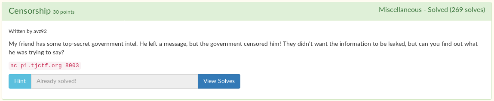

# Censorship



Upon connecting to the server, you have to solve a math problem to see the information.

```
$ nc p1.tjctf.org 8003
To prove you are worthy of this information, what is 4 + 4?
8

tjctf{[CENSORED]}
```

When you solve the problem, you get back `tjctf{[CENSORED]}`

I thought that the data might be hidden, so I made a python script to solve the math and print what it receives.

```python
from pwn import *

r = remote('p1.tjctf.org', 8003)

r.recvuntil("what is ")

problem = r.recvuntil("?").decode().replace("?", "")
print(problem)

r.send(str(eval(problem)))
r.send('\n')

r.interactive()
```

When you run the script, you can see the actual hidden flag.

```
$ py sol.py
[+] Opening connection to p1.tjctf.org on port 8003: Done
2 + 4
[*] Switching to interactive mode


tjctf{TH3_1llum1n4ti_I5_R3aL}tjctf{[CENSORED]}            
[*] Got EOF while reading in interactive
```

Flag: `tjctf{TH3_1llum1n4ti_I5_R3aL}`
