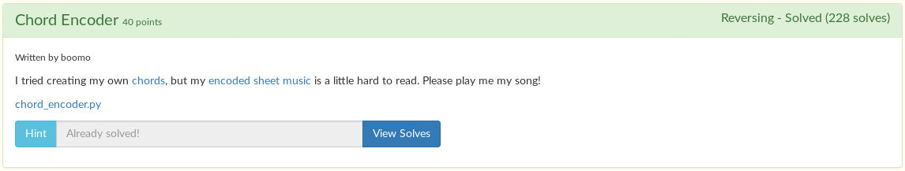
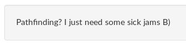

# Chord Encoder



We are given a [python script](chord_encoder.py), along with two more files, [chord.py](chord.py) and [notes.txt](notes.txt).

```python
f = open('song.txt').read()

l = {'1':'A', '2':'B', '3':'C', '4':'D', '5':'E', '6':'F', '7':'G'}
chords = {}
for i in open('chords.txt').readlines():
	c, n = i.strip().split()
	chords[c] = n

s = ''
for i in f:
	c1, c2 = hex(ord(i))[2:]
	if c1 in l:
		c1 = l[c1]
	if c2 in l:
		c2 = l[c2]
	s += chords[c1] + chords[c2]
open('notes.txt', 'w').write(s)
```

It looks like we have to recover `song.txt` to get the flag.

My first attempt at doing this was literally do the reverse of what it was doing.

The program encoded the flag by converting the flag to hex and splitting the two hex digits. Then, it checks if the character is in the range 1-7. If it is, it is turned into its alphabetical representation. Then, it converts that chord to the corresponding numbers found in [chords.txt](chords.txt). The output goes into [notes.txt](notes.txt). This is a very poor way of encrypting messages, as not every character can fit this specification. (More on that later.)

I spent a lot of time making a script that does exactly the reverse of this. I converted the numbers back to chords using a loop, shown below.

```python
while len(notes) != 0:
	for chord in chords:
		if notes[:len(chord[0])] == chord[0]:
			nC += chord[1]
			notes = notes[len(chord[0]):]
			print(nC)
			print(notes)
			break
```

...but it was having some truble decoding it. Looking at [chords.txt](chords.txt), there are two chords that are very similar to one another:

```
D 020
E 0200
```

Very similar indeed. But how to tell the difference?

I decided to make a variable called success, and set it to true if it didn't fail to find a chord. Then, if it failed, it would just simply replace the D with an E. It's a bit hacky, as you can tell just by looking at it, but at the time I thought that I was sooo clever and smart and that it would work perfectly.

```python
while len(notes) != 0:
	for chord in chords:
		success = False
		if notes[:len(chord[0])] == chord[0]:
			nC += chord[1]
			notes = notes[len(chord[0]):]
			print(nC)
			print(notes)
			success = True
			break
	if not success: ## Probably because of the dumb D and E, we need to fix that, because they are similar
		note = nC.pop()
		nC.append('E')
		notes = notes[1:] ## remove the one from the beginning, should help
```

Then, using the chords in [chords.txt](chords.txt), I converted the chords to hex digits..

```python
hf = []
for c in nC:
	for i in range(len(chords)):
		if c == chords[i][1]:
			c = chords[i][1]
		if c in l:
			c = l[c]
	hf += c

print(hf)
```

...combined the digits...

```python
lagArr = []

for i in range(int(len(hf) / 2)):
	flagArr.append('0x' + hf[i*2] + hf[(i*2)+1])

print(flagArr)
```

...and combined the chars to get the flag.

```python
flag = ''
for c in flagArr:
	flag += chr(int(c, 16))

print(flag)
```

I thought that would be the solution, but of course not.

```
flag{zatsEwotE1EcallEaEmd\oDu
```

Close, but not good enough.

I tried everything I could to make it work, I spent so much time trying to fix it...

```python
if not success: ## Probably because of the dumb D and E, we need to fix that, because they are similar
	note = nC.pop()
	if note == 'D':
		nC.append('E')
		notes = notes[1:] ## remove the one from the beginning, should help
	if note == 'd':
		nC.append('e')
		notes = notes[1:] ## remove the one from the beginning, should help
	if note == 'g':
		nC.append('g')
```

...but that just made it worse:

```
flag{zatsWv÷E1V6ÆÅaVÖ\oD~
```

I had no idea what to do next. I was stumped. Then I saw the hint:



Pathfinding! Of course! Why didn't I think of that?

I copied the original [chord encoder script](chord_encoder.py) and modified it so it would take every ASCII char as input. Then, I printed out every possible chord combination. This is smarter, because it is looking at full characters, not just split hex parts of characters.

```python
f = ''.join([chr(i) for i in range(0, 256)])

l = {'1':'A', '2':'B', '3':'C', '4':'D', '5':'E', '6':'F', '7':'G'}
chords = {}
for i in open('chords.txt').readlines():
	c, n = i.strip().split()
	chords[c] = n

s = ''
for i in f:
	try:
		c1, c2 = hex(ord(i))[2:]
		if c1 in l:
			c1 = l[c1]
		if c2 in l:
			c2 = l[c2]
		print(hex(ord(i)), chords[c1]+chords[c2]) ## print all possible combinations
		s += chords[c1]+chords[c2]
	except: ## if there was an error, just do nothing
		int() ## this is what I just use as a placeholder function in python, nothing special here
```

I then piped the output to a file.

```
$ py possible_chars.py > pc
$ cat pc
0x11 01120112
0x12 01122110
0x13 01121012
0x14 0112020
0x15 01120200
0x16 01121121
0x17 0112001
0x1a 01120122
0x1b 01122100
0x1c 01121002
0x1d 0112010
0x1e 01120100
0x1f 01121011
0x21 21100112
0x22 21102110
0x23 21101012
...
```

On to coding the pathfinder. First, I read the notes from a file, and read the possible chars file we created earlier.

```python
fn = input("File to decode? ")

with open(fn, 'r') as file:
    notes = file.read().replace('\n', '')

with open('pc', 'r') as file:
    pc = file.read().split('\n') ## possible chars

for i in range(len(pc)):
    pc[i] = pc[i].split(' ')
```

The pathfinder then loops through all the possible chars and compares them to the notes, but this time it doesn't break on the first match. Instead, it creates a node for each match it finds. Each node does the same thing, and then it deletes itself upon completion. This essentially goes through every path until the final message is found. You can see the code [here](sol.py).

```
$ py sol.py
File to decode? notes.txt
f
fl
fla
flag
flag{
flag{z
flag{za
flag{zat
flag{zau
flag{zats
flag{zatsM
flag{zats_
flag{zats_w
flag{zats_wo
flag{zats_wot
flag{zats_wou
flag{zats_wotM
flag{zats_wot_
flag{zats_wot_1
flag{zats_wot_1M
flag{zats_wot_1_
flag{zats_wot_1_c
flag{zats_wot_1_ca
flag{zats_wot_1_cal
flag{zats_wot_1_call
flag{zats_wot_1_callM
flag{zats_wot_1_call_
flag{zats_wot_1_call_a
flag{zats_wot_1_call_aM
flag{zats_wot_1_call_a_
flag{zats_wot_1_call_a_m
flag{zats_wot_1_call_a_md
flag{zats_wot_1_call_a_me
flag{zats_wot_1_call_a_mel
flag{zats_wot_1_call_a_melo
flag{zats_wot_1_call_a_meloD
flag{zats_wot_1_call_a_meloE
flag{zats_wot_1_call_a_meloD}
```

Flag: `flag{zats_wot_1_call_a_meloD}`
