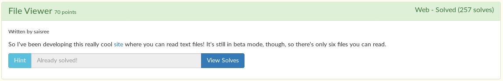
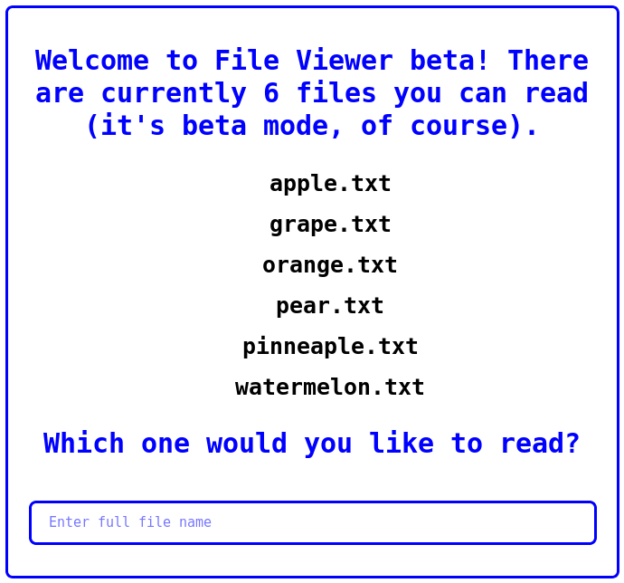
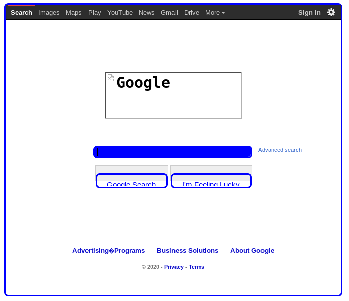
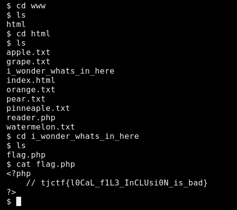

# File Viewer



When you visit the site, you are given this welcome screen:



When you enter one of the files (ex: watermelon.txt) it reads you the file:


You can also notice that the file you enter is in the path of the url:

```
https://file_viewer.tjctf.org/reader.php?file=watermelon.txt
```

I quickly found out that you can enter a URL for another site, and it works just fine. (ex: https://www.google.com/)



This probably means we can execute PHP code. I tested it with pastebin, and it worked!

After a little searching on the web, I found [this PHP reverse shell](http://pentestmonkey.net/tools/web-shells/php-reverse-shell) from pentestmonkey. I edited the IP and port to match my own, and uploaded it to pastebin. I then went to the pastebin URL with the [file viewer](https://file_viewer.tjctf.org/).

And, surprise surprise, the reverse shell worked, and I had access to the machine! After some digging, I found out that all the HTML files were in `/var/www/html`, and you know the rest.



Flag: `tjctf{l0CaL_f1L3_InCLUsi0N_is_bad}`
