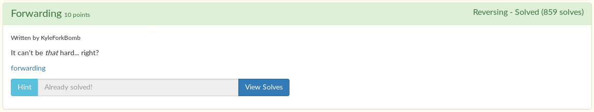

# Forwarding



Simple reversing challenge. Running `strings` on the binary gets you the flag.

```
$ strings forwarding | grep tjctf
tjctf{just_g3tt1n9_st4rt3d}
```

Flag: `tjctf{just_g3tt1n9_st4rt3d}`
