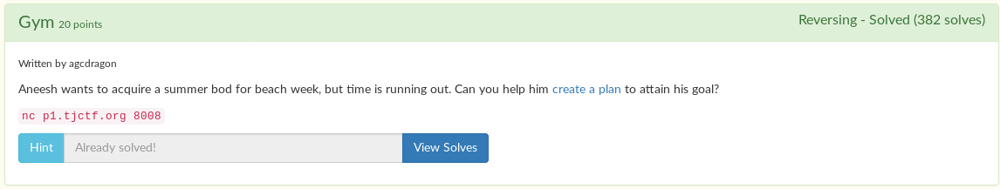

# Gym



We are given an [executable we need to reverse](gym). I used [ghidra](https://ghidra-sre.org/) to decompile the binary. You can find the decompiled source [here](gym.c).

```
$ ./gym
I'm currently 211 lbs. Can I be exactly 180? Help me out!
-------------------------
Today is day 1.

Choose an activity:
[1] Eat healthy
[2] Do 50 push-ups
[3] Go for a run.
[4] Sleep 8 hours.
```

The goal of the challenge is to get to 180 pounds. We have 4 choices to choose from.

```c
fgets(local_98,4,stdin);
iVar1 = atoi(local_98);
if (iVar1 == 2) {
  iVar1 = do_pushup((ulong)local_a8);
  local_ac = local_ac - iVar1;
}
else {
  if (iVar1 < 3) {
    if (iVar1 == 1) {
      iVar1 = eat_healthy((ulong)local_a8);
      local_ac = local_ac - iVar1;
    }
  }
  else {
    if (iVar1 == 3) {
      iVar1 = go_run((ulong)local_a8);
      local_ac = local_ac - iVar1;
    }
    else {
      if (iVar1 != 4) goto LAB_00100b5d;
    }
    iVar1 = go_sleep((ulong)local_a8);
    local_ac = local_ac - iVar1;
  }
}
```

Depending on what we choose, the result of the function that is called is what is subtracted from the weight.

```c
int eat_healthy(void)
{
  return 4;
}

int do_pushup(void)
{
  return 1;
}

int go_run(void)
{
  return 2;
}

int go_sleep(void)
{
  return 3;
}
```

Unfortunately, we only have 7 days to reach our goal. We need to lose a total of 31 pounds to get the flag. But if we lose 4 pounds every day for a week, we can only lose 28 pounds max. What to do?

Well, there's actually a bug in the code:

```c
if (iVar1 == 3) {
  iVar1 = go_run((ulong)local_a8);
  local_ac = local_ac - iVar1;
}
else {
  if (iVar1 != 4) goto LAB_00100b5d;
}
iVar1 = go_sleep((ulong)local_a8);
local_ac = local_ac - iVar1;
```

If you enter in a 3, the result of `go_run()` is subtracted from the total weight. But here's the thing. `go_sleep()` is also subtracted from the weight after that, due to poor coding. This bug could have been prevented were it written this way:

```c
if (iVar1 == 3) {
  iVar1 = go_run((ulong)local_a8);
  local_ac = local_ac - iVar1;
}
else {
  if (iVar1 != 4) goto LAB_00100b5d;
  iVar1 = go_sleep((ulong)local_a8);
  local_ac = local_ac - iVar1;
}
```

This means that instead of subtracting 2 pounds from the weight, as intended, 5 pounds is subtracted instead! :O

I made a simple python script to do all the math for me, because I'm too lazy to do it myself honestly.

```python
from pwn import *

if 'rem' in sys.argv:
    r = remote('p1.tjctf.org', 8008)
else:
    r = process('./gym')

## Person is 211 lbs, he/she needs to be 180
## [2] Do 50 push-ups - Lose 1 pound
## [4] Sleep 8 hours. - Lose 3 pounds
## [1] Eat healthy - Lose 4 pounds
## [3] Go for a run. - Lose 5 pounds

order = [3, 1, 4, 2]

tL = 211 - 180 ## toLose

count = 0
while tL != 0:
    if count != 0:
        a = 4 - count
    else:
        a = 5
    while tL >= a:
        tL -= a
        print(tL)
        r.send(str(order[count]))
        r.send('\n')
    count += 1
r.interactive()
```

```
$ py sol.py rem
[+] Opening connection to p1.tjctf.org on port 8008: Done
...
Congrats on reaching your weight goal!
Here is your prize: tjctf{w3iGht_l055_i5_d1ff1CuLt}
[*] Got EOF while reading in interactive
$
```

Flag: `tjctf{w3iGht_l055_i5_d1ff1CuLt}`
