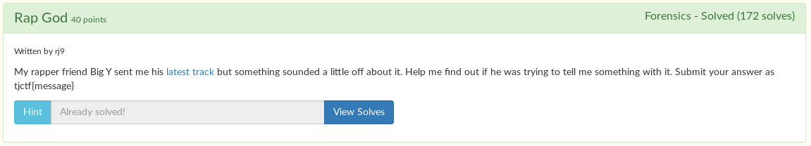
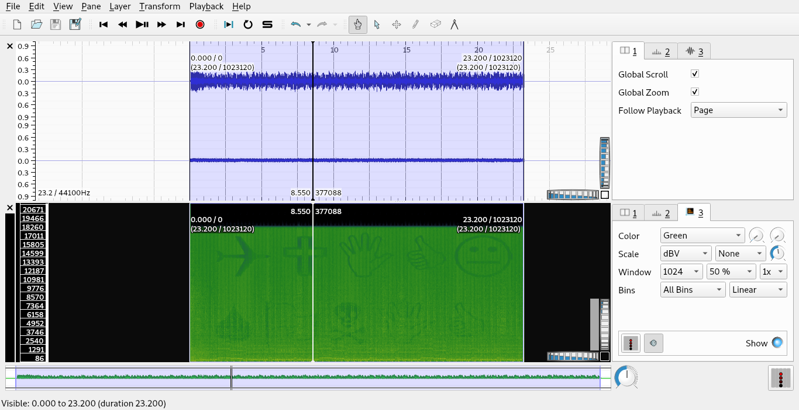

# Rap God

We are given a [mp3 file](BigYAudio.mp3).

You can use [sonic visualizer](https://sonicvisualiser.org/) to view the second channel in spectrogram view. All you have to do is decode the wing dings to get the flag.

Flag: `tjctf{quicksonic}`
