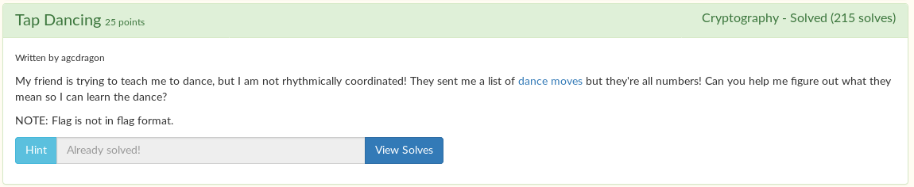

# Tap Dancing



We are given this [strange cipher](cipher.txt). There are a bunch of numbers ranging from 0 to 2.

Someone gave me a hint that it's similar to [tap code](https://www.braingle.com/brainteasers/codes/tapcode.php). My first guess was that it was morse code. I was too lazy to do it by hand, so I made a simple [python script](sol.py) to change the zeroes, ones, and twos to spaces, dashes, and dots.

```python
morse = '1101111102120222020120111110101222022221022202022211'

morse = morse.replace('0', ' ')
morse = morse.replace('1', '-')
morse = morse.replace('2', '.')

print(morse)
```

```
$ py sol.py
-- ----- .-. ... . -. ----- - -... ....- ... . ...--
```

All you have to do now is look up a morse code to text converter and input the morse code to get the flag!

Flag: `m0rsen0tb4se3`
