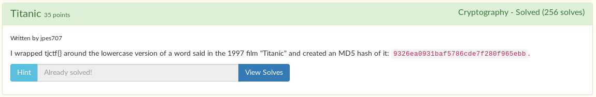

# Titanic



After some searching, I found [this titanic script](https://www.imsdb.com/scripts/Titanic.html).

I made a python script to try every word said in titanic for me, and compare it to the MD5 hash given: `9326ea0931baf5786cde7f280f965ebb`

I also used python 2, just because it's easier.

```python
from hashlib import *
import re

alpha = re.compile('[^a-zA-Z{}]')
hash = 'e246dbab7ae3a6ed41749e20518fcecd'

with open('words.txt', 'r') as file:
    script = file.read().replace('\n', ' ').split(' ')

for word in script:
    word = word.lower()
    flag = alpha.sub('', "tjctf{flag}".replace("flag", word))
    if flag != 'tjctf{}':
        print flag
        if md5(flag).hexdigest() == hash:
            print "Flag found! Flag is " + flag
            break
```

Unfortunately, it didn't work. It didn't find the flag. I didn't figure it out until the author told me that the word might have other symbols, like apostrophes and hyphens.

I added that to the regex, and it worked like a charm!

```python
alpha = re.compile('[^a-zA-Z{}\'-]')
```

```
$ python sol.py
...
tjctf{a}
tjctf{beautiful}
tjctf{sunny}
tjctf{spot}
tjctf{enclosed}
tjctf{by}
tjctf{high}
tjctf{arched}
tjctf{windows}
tjctf{andrews}
tjctf{disliking}
tjctf{the}
tjctf{attention}
tjctf{well}
tjctf{i}
tjctf{may}
tjctf{have}
tjctf{knocked}
tjctf{her}
tjctf{together}
tjctf{but}
tjctf{the}
tjctf{idea}
tjctf{was}
tjctf{mr}
tjctf{ismay's}
Flag found! Flag is tjctf{ismay's}
```

Flag: `tjctf{ismay's}`

EDIT: I found out that the flag has changed since then. The hash is different now.
