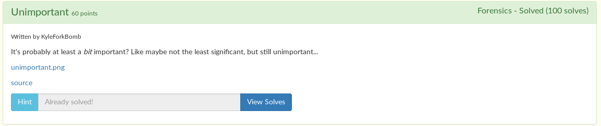

# Unimportant



We are given an [image](unimportant.png) and the [source code](encode.py) used to create that image.

The image is an A quality meme, shown below.


In the [encoding script](encode.py), the flag was converted to its binary form first.

```python
with open("flag.txt", "rb") as f:
	flag = f.read()
binstr = bin(int(binascii.hexlify(flag), 16))
bits = [int(x) for x in binstr[2:]]
```

Then, those bits were hidden in the second least significant bit of each pixel.

```python
pixel = (pixel[0], pixel[1]&~0b10|(bits[i]<<1), pixel[2], pixel[3])
```

All we have to do is restore it. I decided to just brute force it, because it's easier and I'm lazy.

```python
flag = b''
## Bruteforce, yeah!
i = 0
gB = '' ## guess bits
while True:
    gB += bits[i]
    try:
        flag = bytes.fromhex(hex(int(gB, 2))[2:])
    except:
        int()
    if b'}' in flag:
        print("Flag found! Flag:", flag)
        break
    i += 1
```

```
$ py sol.py
Flag found! Flag: b'tjctf{n0t_th3_le4st_si9n1fic4nt}'
```

If this was an actual message and not a flag, you could search for a line break instead.

```python
if b'\n' in flag:
    print("Flag found! Flag:", flag)
    break
```

```
$ py sol.py
Flag found! Flag: b'tjctf{n0t_th3_le4st_si9n1fic4nt}\n'
```

Flag: `tjctf{n0t_th3_le4st_si9n1fic4nt}`
