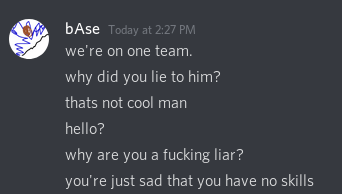
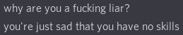

# UMDCTF2020

This CTF was happening at the same time WPICTF was going on, so I decided to only do one challenge.

I did this as an audition for a team called RGBsec (formerly known as RGBpwn)

I did Cowspeak as a Service, and it was pretty fun. Someone on my team finished it 20 minutes before me, though, so I didn't get the points!

In the end, I didn't get in. It's a high school team though...

...so I didn't lose out on anything! :joy:
