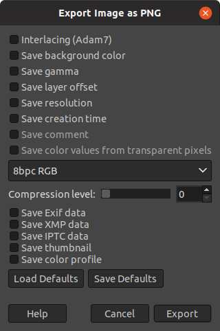

# Luna

We are given a [tar archive](Luna.tar.xz). Let's extract it.

```
$ tar xf Luna.tar.xz
```

Upon extraction, we find two new files:

```
$ ls
 1.png
 Luna.tar.xz
'so you take the moon and you take the moon and you take the moon and you take the moon and you take the moon and you take the moon and you take the moon and you take the moon.zip'
```

We have an image, and a zip with a strangely long name.

I attempted to unzip the file, but it seems like it needs a password:

```
Archive:  so you take the moon and you take the moon and you take the moon and you take the moon and you take the moon and you take the moon and you take the moon and you take the moon.zip
[so you take the moon and you take the moon and you take the moon and you take the moon and you take the moon and you take the moon and you take the moon and you take the moon.zip] jut password:
```

I figured that the password has to be somewhere in the image, so I took a look.

When I opened the image, it was just a white square. I ran `file` on the image to see the specifics:

```
$ file 1.png
1.png: PNG image data, 300 x 300, 8-bit/color RGB, non-interlaced
```

I also ran strings on it to see if there was a password in it somewhere.

```
$ strings 1.png
IHDR
zTXtRaw profile type exif
v,z}O
$k[F5<
es1.
R&dR6"
~,94TU4
e3s+V]<
aaTv
fzTXtRaw profile type iptc
RiTXtXML:com.adobe.xmp
<?xpacket begin="
" id="W5M0MpCehiHzreSzNTczkc9d"?>
<x:xmpmeta xmlns:x="adobe:ns:meta/" x:xmptk="XMP Core 4.4.0-Exiv2">
 <rdf:RDF xmlns:rdf="http://www.w3.org/1999/02/22-rdf-syntax-ns#">
  <rdf:Description rdf:about=""
    xmlns:iptcExt="http://iptc.org/std/Iptc4xmpExt/2008-02-29/"
    xmlns:xmpMM="http://ns.adobe.com/xap/1.0/mm/"
    xmlns:stEvt="http://ns.adobe.com/xap/1.0/sType/ResourceEvent#"
    xmlns:plus="http://ns.useplus.org/ldf/xmp/1.0/"
    xmlns:DICOM="http://ns.adobe.com/DICOM/"
    xmlns:GIMP="http://www.gimp.org/xmp/"
    xmlns:dc="http://purl.org/dc/elements/1.1/"
    xmlns:photoshop="http://ns.adobe.com/photoshop/1.0/"
    xmlns:xmp="http://ns.adobe.com/xap/1.0/"
   iptcExt:DigitalSourceType="http://cv.iptc.org/newscodes/digitalsourcetype/softwareImage"
   xmpMM:DocumentID="gimp:docid:gimp:456e1492-77c3-4f45-92c3-edd0541a4413"
   xmpMM:InstanceID="xmp.iid:3e22a217-d4a0-422b-9bc6-58f60eddf54d"
   xmpMM:OriginalDocumentID="xmp.did:cc8dad5e-07b5-4920-9533-fc26a32b80f0"
   plus:ModelReleaseStatus="http://ns.useplus.org/ldf/vocab/MR-NON"
   DICOM:StudyPhysician="awcIsALegendAndIHopeThisIsAStrongPasswordJackTheRipperBegone"
   GIMP:API="2.0"
   GIMP:Platform="Linux"
   GIMP:TimeStamp="1584748572978367"
   GIMP:Version="2.10.18"
   dc:Format="image/png"
   photoshop:CaptionWriter="j00t"
   photoshop:DateCreated="2020-03-20"
   xmp:CreatorTool="GIMP 2.10"
   xmp:Rating="5">
   <iptcExt:LocationCreated>
    <rdf:Bag/>
   </iptcExt:LocationCreated>
   <iptcExt:LocationShown>
    <rdf:Bag/>
   </iptcExt:LocationShown>
   <iptcExt:ArtworkOrObject>
    <rdf:Bag/>
   </iptcExt:ArtworkOrObject>
   <iptcExt:RegistryId>
    <rdf:Bag/>
   </iptcExt:RegistryId>
   <iptcExt:PersonInImage>
    <rdf:Bag>
     <rdf:li>type="Bag" jutin</rdf:li>
    </rdf:Bag>
   </iptcExt:PersonInImage>
   <xmpMM:History>
    <rdf:Seq>
     <rdf:li
      stEvt:action="saved"
      stEvt:changed="/metadata"
      stEvt:instanceID="xmp.iid:967142e5-a3e0-4326-8335-bbe854fe7477"
      stEvt:softwareAgent="Gimp 2.10 (Linux)"
      stEvt:when="-04:00"/>
     <rdf:li
      stEvt:action="saved"
      stEvt:changed="/"
      stEvt:instanceID="xmp.iid:8b519cd0-a1e9-41f7-ae1b-5b66b66b699e"
      stEvt:softwareAgent="Gimp 2.10 (Linux)"
      stEvt:when="-04:00"/>
     <rdf:li
      stEvt:action="saved"
      stEvt:changed="/metadata"
      stEvt:instanceID="xmp.iid:b7345da5-469a-491b-86b2-ad14b96f1132"
      stEvt:softwareAgent="Gimp 2.10 (Linux)"
      stEvt:when="-04:00"/>
     <rdf:li
      stEvt:action="saved"
      stEvt:changed="/metadata"
      stEvt:instanceID="xmp.iid:69b7dcf5-be9f-446d-8614-9ddda3bded58"
      stEvt:softwareAgent="Gimp 2.10 (Linux)"
      stEvt:when="-04:00"/>
     <rdf:li
      stEvt:action="saved"
      stEvt:changed="/"
      stEvt:instanceID="xmp.iid:f39a3ecb-64e6-4b8b-98f1-fcb5eb4e1539"
      stEvt:softwareAgent="Gimp 2.10 (Linux)"
      stEvt:when="-04:00"/>
    </rdf:Seq>
   </xmpMM:History>
   <plus:ImageSupplier>
    <rdf:Seq/>
   </plus:ImageSupplier>
   <plus:ImageCreator>
    <rdf:Seq/>
   </plus:ImageCreator>
   <plus:CopyrightOwner>
    <rdf:Seq/>
   </plus:CopyrightOwner>
   <plus:Licensor>
    <rdf:Seq/>
   </plus:Licensor>
   <dc:description>
    <rdf:Alt>
     <rdf:li xml:lang="x-default">oops, all #FFD2A4#</rdf:li>
    </rdf:Alt>
   </dc:description>
  </rdf:Description>
 </rdf:RDF>
</x:xmpmeta>


<?xpacket end="w"?>
iCCPICC profile
Qp-8
Xupq
; X+1
n5k1  
J|N<j
f*9O,
q,b
bKGD
	pHYs
tIME
vIDATx
`B0!`B0!`B0!`B0!`B0!`B0!`B0!`B0!`B0!`B0!`B0!`B0!`B0!`B0!`B0!`B0!`B0!`B0!`B0!`B0!`B0!`B0!`B0!`B0!`B0!`B0!`B0!`B0!`B0!`B0!`B0!`B0!`B0!
IEND
```

I examined the output, and I found it.

```
DICOM:StudyPhysician="awcIsALegendAndIHopeThisIsAStrongPasswordJackTheRipperBegone"
```

The password was in plain text!

```
awcIsALegendAndIHopeThisIsAStrongPasswordJackTheRipperBegone
```

I extracted the zip with that password, and I got two more files:

```
Archive:  so you take the moon and you take the moon and you take the moon and you take the moon and you take the moon and you take the moon and you take the moon and you take the moon.zip
[so you take the moon and you take the moon and you take the moon and you take the moon and you take the moon and you take the moon and you take the moon and you take the moon.zip] jut password:
  inflating: jut                     
  inflating: Just In Case.png
```

Here's the image from that extraction:



It looks like a screenshot from GIMP. No idea what that's about.

Moving on. Let's look at jut.

I ran `binwalk` on that file, and I found this:

```
$ binwalk jut

DECIMAL       HEXADECIMAL     DESCRIPTION
--------------------------------------------------------------------------------
45            0x2D            Zlib compressed data, best compression
```

Looks like it uses zlib compression. Let's extract it!

```
$ dd if=jut bs=1 skip=45 of=arch.zlib
17893+0 records in
17893+0 records out
17893 bytes (18 kB, 17 KiB) copied, 0.0473859 s, 378 kB/s
```

To double-check that it's zlib, I ran the file utility on it to double-check:

```
$ file arch.zlib
arch.zlib: zlib compressed data
```

Sure enough, it's zlib.

I used `zlib-flate` to decompress it, and then I piped the output to a file.

```
$ (zlib-flate -uncompress < arch.zlib) > uncompressed
```

I ran binwalk on it, but with no success.

```
$ binwalk uncompressed

DECIMAL       HEXADECIMAL     DESCRIPTION
--------------------------------------------------------------------------------

```

So then I ran the file utility again, and it seems to be ASCII text.

```
$ file uncompressed
uncompressed: ASCII text
```

I ran `more` on it to have a look inside, and it looks like hex!

```
$ more uncompressed

exif
    5364
45786966000049492a00080000000a0000010400010000002c0100000101040001000000
2c0100000201030003000000860000001a010500010000008c0000001b01050001000000
94000000280103000100000003000000310102000d0000009c0000003201020014000000
aa0000006987040001000000be0000002588040001000000d00000003201000008000800
0800fc2900005b000000fc2900005b00000047494d5020322e31302e3138000032303230
3a30333a32302031393a30343a313700010001a003000100000001000000000000000300
0200050003000000fa00000004000500030000001201000006000500010000002a010000
000000000000000001000000000000000100000000000000010000000000000001000000
00000000010000000000000001000000000000000a000000080000010400010000000001
000001010400010000000001000002010300030000009801000003010300010000000600
000006010300010000000600000015010300010000000300000001020400010000009e01
000002020400010000005013000000000000080008000800ffd8ffe000104a4649460001
0100000100010000ffdb004300080606070605080707070909080a0c140d0c0b0b0c1912
130f141d1a1f1e1d1a1c1c20242e2720222c231c1c2837292c30313434341f27393d3832
3c2e333432ffdb0043010909090c0b0c180d0d1832211c21323232323232323232323232
323232323232323232323232323232323232323232323232323232323232323232323232
3232ffc00011080100010003012200021101031101ffc4001f0000010501010101010100
000000000000000102030405060708090a0bffc400b51000020103030204030505040400
00017d01020300041105122131410613516107227114328191a1082342b1c11552d1f024
33627282090a161718191a25262728292a3435363738393a434445464748494a53545556
5758595a636465666768696a737475767778797a838485868788898a9293949596979899
9aa2a3a4a5a6a7a8a9aab2b3b4b5b6b7b8b9bac2c3c4c5c6c7c8c9cad2d3d4d5d6d7d8d9
dae1e2e3e4e5e6e7e8e9eaf1f2f3f4f5f6f7f8f9faffc4001f0100030101010101010101
010000000000000102030405060708090a0bffc400b51100020102040403040705040400
010277000102031104052131061241510761711322328108144291a1b1c109233352f015
6272d10a162434e125f11718191a262728292a35363738393a434445464748494a535455
565758595a636465666768696a737475767778797a82838485868788898a929394959697
98999aa2a3a4a5a6a7a8a9aab2b3b4b5b6b7b8b9bac2c3c4c5c6c7c8c9cad2d3d4d5d6d7
d8d9dae2e3e4e5e6e7e8e9eaf2f3f4f5f6f7f8f9faffda000c03010002110311003f00f5
aa28a2bc33d70a28a2800a28a2800a28a2800a28a2800a28a2800a28a2800a28a2800a28
a2800a28a2800a28a2800a28a2800a28a2800a28a2800a28a2800a28a2800a28a2800a28
a2800a28a2800a28a2800a28a2800a28a2800a28a2800a28a2800a28a2800a28a5009e80
9fa530128a52a57a823ea292800a28a29005145140051451400514514005145140051451
```

I used nano to edit out the beginning part. It wasn't valid hex.

New file looks like this:

```
$ more uncompressed
45786966000049492a00080000000a0000010400010000002c0100000101040001000000
2c0100000201030003000000860000001a010500010000008c0000001b01050001000000
94000000280103000100000003000000310102000d0000009c0000003201020014000000
aa0000006987040001000000be0000002588040001000000d00000003201000008000800
0800fc2900005b000000fc2900005b00000047494d5020322e31302e3138000032303230
3a30333a32302031393a30343a313700010001a003000100000001000000000000000300
0200050003000000fa00000004000500030000001201000006000500010000002a010000
000000000000000001000000000000000100000000000000010000000000000001000000
00000000010000000000000001000000000000000a000000080000010400010000000001
000001010400010000000001000002010300030000009801000003010300010000000600
000006010300010000000600000015010300010000000300000001020400010000009e01
000002020400010000005013000000000000080008000800ffd8ffe000104a4649460001
0100000100010000ffdb004300080606070605080707070909080a0c140d0c0b0b0c1912
130f141d1a1f1e1d1a1c1c20242e2720222c231c1c2837292c30313434341f27393d3832
3c2e333432ffdb0043010909090c0b0c180d0d1832211c21323232323232323232323232
323232323232323232323232323232323232323232323232323232323232323232323232
3232ffc00011080100010003012200021101031101ffc4001f0000010501010101010100
000000000000000102030405060708090a0bffc400b51000020103030204030505040400
00017d01020300041105122131410613516107227114328191a1082342b1c11552d1f024
33627282090a161718191a25262728292a3435363738393a434445464748494a53545556
5758595a636465666768696a737475767778797a838485868788898a9293949596979899
9aa2a3a4a5a6a7a8a9aab2b3b4b5b6b7b8b9bac2c3c4c5c6c7c8c9cad2d3d4d5d6d7d8d9
dae1e2e3e4e5e6e7e8e9eaf1f2f3f4f5f6f7f8f9faffc4001f0100030101010101010101
010000000000000102030405060708090a0bffc400b51100020102040403040705040400
010277000102031104052131061241510761711322328108144291a1b1c109233352f015
6272d10a162434e125f11718191a262728292a35363738393a434445464748494a535455
565758595a636465666768696a737475767778797a82838485868788898a929394959697
98999aa2a3a4a5a6a7a8a9aab2b3b4b5b6b7b8b9bac2c3c4c5c6c7c8c9cad2d3d4d5d6d7
d8d9dae2e3e4e5e6e7e8e9eaf2f3f4f5f6f7f8f9faffda000c03010002110311003f00f5
aa28a2bc33d70a28a2800a28a2800a28a2800a28a2800a28a2800a28a2800a28a2800a28
a2800a28a2800a28a2800a28a2800a28a2800a28a2800a28a2800a28a2800a28a2800a28
a2800a28a2800a28a2800a28a2800a28a2800a28a2800a28a2800a28a2800a28a5009e80
9fa530128a52a57a823ea292800a28a29005145140051451400514514005145140051451
40051451400a0e181c6707a569df4117d904b122af43903b1acbad8b6ff48d3761ebb4ad
74e1d292947c8c2b3716a463d6869b023891e450c071c8acfe95a89fb8d249eee3f9ff00
f5aa6825cd77d0aacfddb2ea43a940b1488c8a1548e80551ad4b9fdfe991c9dd719fe559
```

I then used `xxd` to convert the hex to bytes and them I dumped it into a file:

```
$ cat uncompressed | xxd -r -p > hex_decoded
```

Running `binwalk` on that shows that theres a `JPEG` hiding in there! :O

```
$ binwalk hex_decoded

DECIMAL       HEXADECIMAL     DESCRIPTION
--------------------------------------------------------------------------------
6             0x6             TIFF image data, little-endian offset of first image directory: 8
420           0x1A4           JPEG image data, JFIF standard 1.01
```

It might be the flag, let's check it out.

I used `dd` again to get the `JPEG` image:

```
$ dd if=hex_decoded bs=1 skip=420 of=flag.jpg
4944+0 records in
4944+0 records out
4944 bytes (4.9 kB, 4.8 KiB) copied, 0.0169934 s, 291 kB/s
```

And sure enough when you open it, it's the flag!


Flag: `WPI{M00N_mOOn}`
