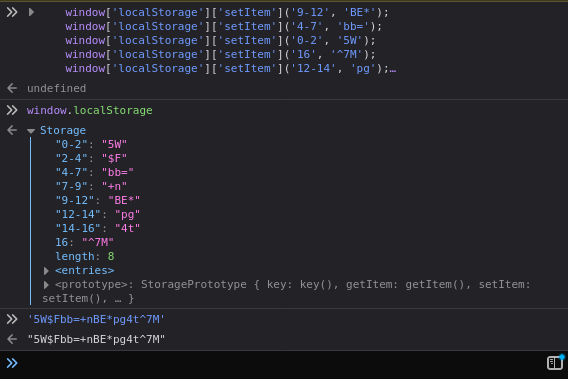

# Secure Portal

>This is a super secure portal with a really unusual HTML file. Try to login.
>
>http://chall.csivit.com:30281

The page is asking for a password. Looking at the page source I found this obfuscated JavaScript code:

```javascript
var _0x575c=['\x32\x2d\x34','\x73\x75\x62\x73\x74\x72\x69\x6e\x67','\x34\x2d\x37','\x67\x65\x74\x49\x74\x65\x6d','\x64\x65\x6c\x65\x74\x65\x49\x74\x65\x6d','\x31\x32\x2d\x31\x34','\x30\x2d\x32','\x73\x65\x74\x49\x74\x65\x6d','\x39\x2d\x31\x32','\x5e\x37\x4d','\x75\x70\x64\x61\x74\x65\x49\x74\x65\x6d','\x62\x62\x3d','\x37\x2d\x39','\x31\x34\x2d\x31\x36','\x6c\x6f\x63\x61\x6c\x53\x74\x6f\x72\x61\x67\x65',];(function(_0x4f0aae,_0x575cf8){var _0x51eea2=function(_0x180eeb){while(--_0x180eeb){_0x4f0aae['push'](_0x4f0aae['shift']());}};_0x51eea2(++_0x575cf8);}(_0x575c,0x78));var _0x51ee=function(_0x4f0aae,_0x575cf8){_0x4f0aae=_0x4f0aae-0x0;var _0x51eea2=_0x575c[_0x4f0aae];return _0x51eea2;};function CheckPassword(_0x47df21){var _0x4bbdc3=[_0x51ee('0xe'),_0x51ee('0x3'),_0x51ee('0x7'),_0x51ee('0x4'),_0x51ee('0xa')];window[_0x4bbdc3[0x0]][_0x4bbdc3[0x2]]('9-12','BE*');window[_0x4bbdc3[0x0]][_0x4bbdc3[0x2]](_0x51ee('0x2'),_0x51ee('0xb'));window[_0x4bbdc3[0x0]][_0x4bbdc3[0x2]](_0x51ee('0x6'),'5W');window[_0x4bbdc3[0x0]][_0x4bbdc3[0x2]]('16',_0x51ee('0x9'));window[_0x4bbdc3[0x0]][_0x4bbdc3[0x2]](_0x51ee('0x5'),'pg');window[_0x4bbdc3[0x0]][_0x4bbdc3[0x2]]('7-9','+n');window[_0x4bbdc3[0x0]][_0x4bbdc3[0x2]](_0x51ee('0xd'),'4t');window[_0x4bbdc3[0x0]][_0x4bbdc3[0x2]](_0x51ee('0x0'),'$F');if(window[_0x4bbdc3[0x0]][_0x4bbdc3[0x1]](_0x51ee('0x8'))===_0x47df21[_0x51ee('0x1')](0x9,0xc)){if(window[_0x4bbdc3[0x0]][_0x4bbdc3[0x1]](_0x51ee('0x2'))===_0x47df21['substring'](0x4,0x7)){if(window[_0x4bbdc3[0x0]][_0x4bbdc3[0x1]](_0x51ee('0x6'))===_0x47df21[_0x51ee('0x1')](0x0,0x2)){if(window[_0x4bbdc3[0x0]][_0x4bbdc3[0x1]]('16')===_0x47df21[_0x51ee('0x1')](0x10)){if(window[_0x4bbdc3[0x0]][_0x4bbdc3[0x1]](_0x51ee('0x5'))===_0x47df21[_0x51ee('0x1')](0xc,0xe)){if(window[_0x4bbdc3[0x0]][_0x4bbdc3[0x1]](_0x51ee('0xc'))===_0x47df21[_0x51ee('0x1')](0x7,0x9)){if(window[_0x4bbdc3[0x0]][_0x4bbdc3[0x1]](_0x51ee('0xd'))===_0x47df21[_0x51ee('0x1')](0xe,0x10)){if(window[_0x4bbdc3[0x0]][_0x4bbdc3[0x1]](_0x51ee('0x0'))===_0x47df21[_0x51ee('0x1')](0x2,0x4))return!![];}}}}}}}return![];}
```

I found this [really cool JS deobfuscator online](https://lelinhtinh.github.io/de4js/) and I used that to deobfuscate most of the JavaScript.

Unfortunately, it looked like it needed some work. It looked [like this](deobfuscated.js).

I found out that `_0x575c` was just a look up table of strings, so I evaluated it and got the unescaped strings. I found out that it wasn't part of the output from the JS deobfuscator I found, so I had to copy and paste that back in myself. I also renamed some variables and functions that had random hex as its name, to make the code more readable.

```javascript
var _lookupTable=[ // look up table of strings
  '2-4',          'substring',
  '4-7',          'getItem',
  'deleteItem',   '12-14',
  '0-2',          'setItem',
  '9-12',         '^7M',
  'updateItem',   'bb=',
  '7-9',          '14-16',
  'localStorage'
];
```

I also found another function whose only purpose was to convert the first argument from a string to a number and look up that index in the loop up table above.

```javascript
var _lookUpStringAtPos = function (_op1, _op2) { // argument 1 is hexadecimal!
    _op1 = _op1 - 0x0; // convert string to number
    var _temp1 = _lookupTable[_op1]; // look up index of lookup table
    return _temp1; // return that string from the lookup table
};
```

You can see below that this function is used often.

```javascript
function CheckPassword(password) {
    var _0x4bbdc3 = [_lookUpStringAtPos('0xe'), _lookUpStringAtPos('0x3'), _lookUpStringAtPos('0x7'), _lookUpStringAtPos('0x4'), _lookUpStringAtPos('0xa')]; // all functions
    window[_0x4bbdc3[0x0]][_0x4bbdc3[0x2]]('9-12', 'BE*');
    window[_0x4bbdc3[0x0]][_0x4bbdc3[0x2]](_lookUpStringAtPos('0x2'), _lookUpStringAtPos('0xb'));
    window[_0x4bbdc3[0x0]][_0x4bbdc3[0x2]](_lookUpStringAtPos('0x6'), '5W');
    window[_0x4bbdc3[0x0]][_0x4bbdc3[0x2]]('16', _lookUpStringAtPos('0x9'));
    window[_0x4bbdc3[0x0]][_0x4bbdc3[0x2]](_lookUpStringAtPos('0x5'), 'pg');
    window[_0x4bbdc3[0x0]][_0x4bbdc3[0x2]]('7-9', '+n');
    window[_0x4bbdc3[0x0]][_0x4bbdc3[0x2]](_lookUpStringAtPos('0xd'), '4t');
    window[_0x4bbdc3[0x0]][_0x4bbdc3[0x2]](_lookUpStringAtPos('0x0'), '$F');
    if (window[_0x4bbdc3[0x0]][_0x4bbdc3[0x1]](_lookUpStringAtPos('0x8')) === password[_lookUpStringAtPos('0x1')](0x9, 0xc)) {
        if (window[_0x4bbdc3[0x0]][_0x4bbdc3[0x1]](_lookUpStringAtPos('0x2')) === password.substring(0x4, 0x7)) {
            if (window[_0x4bbdc3[0x0]][_0x4bbdc3[0x1]](_lookUpStringAtPos('0x6')) === password[_lookUpStringAtPos('0x1')](0x0, 0x2)) {
                if (window[_0x4bbdc3[0x0]][_0x4bbdc3[0x1]]('16') === password[_lookUpStringAtPos('0x1')](0x10)) {
                    if (window[_0x4bbdc3[0x0]][_0x4bbdc3[0x1]](_lookUpStringAtPos('0x5')) === password[_lookUpStringAtPos('0x1')](0xc, 0xe)) {
                        if (window[_0x4bbdc3[0x0]][_0x4bbdc3[0x1]](_lookUpStringAtPos('0xc')) === password[_lookUpStringAtPos('0x1')](0x7, 0x9)) {
                            if (window[_0x4bbdc3[0x0]][_0x4bbdc3[0x1]](_lookUpStringAtPos('0xd')) === password[_lookUpStringAtPos('0x1')](0xe, 0x10)) {
                                if (window[_0x4bbdc3[0x0]][_0x4bbdc3[0x1]](_lookUpStringAtPos('0x0')) === password[_lookUpStringAtPos('0x1')](0x2, 0x4)) return !![];
                            }
                        }
                    }
                }
            }
        }
    }
    return ![];
}
```

So what I did is evaluate each function call to the lookup function and did a find and replace in my text editor with the result.

```javascript
> _lookUpStringAtPos('0xe')
'localStorage'
> _lookUpStringAtPos('0x3')
'getItem'
> _lookUpStringAtPos('0x7')
'setItem'
> _lookUpStringAtPos('0x4')
'deleteItem'
> _lookUpStringAtPos('0xa')
'updateItem'
> _lookUpStringAtPos('0xb')
'bb='
> _lookUpStringAtPos('0x2')
'4-7'
> _lookUpStringAtPos('0x6')
'0-2'
> _lookUpStringAtPos('0x9')
'^7M'
> _lookUpStringAtPos('0x5')
'12-14'
> _lookUpStringAtPos('0xd')
'14-16'
> _lookUpStringAtPos('0x0')
'2-4'
> _lookUpStringAtPos('0x8')
'9-12'
> _lookUpStringAtPos('0x1')
'substring'
> _lookUpStringAtPos('0xc')
'7-9'
>
```

You can see I did this for `_0x4bbdc3` as well, which I renamed to `_functions`

```javascript
> _functions[0x0]
'localStorage'
> _functions[0x2]
'setItem'
> _functions[0x1]
'getItem'
>
```

After all that, you can see that we now have some actually readable code!

```javascript
var _lookupTable=[ // look up table of strings
  '2-4',          'substring',
  '4-7',          'getItem',
  'deleteItem',   '12-14',
  '0-2',          'setItem',
  '9-12',         '^7M',
  'updateItem',   'bb=',
  '7-9',          '14-16',
  'localStorage'
];

(function (_op1, _op2) { // useless function
    var _temp1 = function (_op3) {
        while (--_op3) {
            _op1.push(_op1.shift());
        }
    };
    _temp1(++_op2);
}(_lookupTable, 0x78));
var _lookUpStringAtPos = function (_op1, _op2) { // argument 1 is hexadecimal!
    _op1 = _op1 - 0x0; // convert string to number
    var _temp1 = _lookupTable[_op1]; // look up index of lookup table
    return _temp1; // return that string from the lookup table
};

function CheckPassword(password) {
    var _functions = ['localStorage', 'getItem', 'setItem', 'deleteItem', 'updateItem']; // all functions
    window['localStorage']['setItem']('9-12', 'BE*');
    window['localStorage']['setItem']('4-7', 'bb=');
    window['localStorage']['setItem']('0-2', '5W');
    window['localStorage']['setItem']('16', '^7M');
    window['localStorage']['setItem']('12-14', 'pg');
    window['localStorage']['setItem']('7-9', '+n');
    window['localStorage']['setItem']('14-16', '4t');
    window['localStorage']['setItem']('2-4', '$F');
    if (window['localStorage']['getItem']('9-12') === password['substring'](0x9, 0xc)) {
        if (window['localStorage']['getItem']('4-7') === password.substring(0x4, 0x7)) {
            if (window['localStorage']['getItem']('0-2') === password['substring'](0x0, 0x2)) {
                if (window['localStorage']['getItem']('16') === password['substring'](0x10)) {
                    if (window['localStorage']['getItem']('12-14') === password['substring'](0xc, 0xe)) {
                        if (window['localStorage']['getItem']('7-9') === password['substring'](0x7, 0x9)) {
                            if (window['localStorage']['getItem']('14-16') === password['substring'](0xe, 0x10)) {
                                if (window['localStorage']['getItem']('2-4') === password['substring'](0x2, 0x4)) return !![];
                            }
                        }
                    }
                }
            }
        }
    }
    return ![];
}
```

You can tell by looking at the code that parts of the password are stored in local storage. I know that it's the password because it's being compared to a variable named `password`

What I did is copy and paste the code that stores the password in `localStorage` into firefox developer tools, and then manually copied the password.



When you submit `5W$Fbb=+nBE*pg4t^7M` as the password, you get the flag!

Flag: `csictf{l3t_m3_c0nfus3_y0u}`
