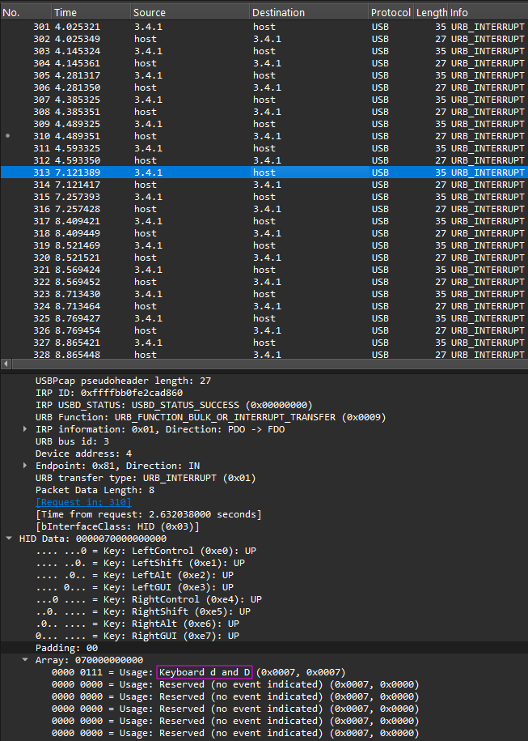

# ordinary keyboard
[Skip to solution](#Solution)


We are given a [packet capture](capture.pcap) full of USB packets.


I've used Wireshark before, but I've never dealt with USB packets before.

After clicking on some of the packets, I noticed that every other packet that came from the keyboard contained a key in it.



In the image above, the key that was sent through is the letter D.

I kept clicking through the packets and noticed it was spelling something out, so I decided to write a [script to find out what was being typed.](keyboard.py)

I've never dealt with packet parsing before, so it was fun to try something new.

I filtered the packets by the USB source, to remove packets coming from the computer to the keyboard. I'm only interested in responses from the keyboard.


I then [exported the packets as plain text.](packets.txt)


I know, I was lazy here, but I too lazy to figure out how to use a packet reading library.

When writing a script to parse the packets, I used a regular expression to search through the text file. (very lazy, I know but it worked)

```python3
text = open('packets.txt').read()
import re
search = re.compile('Keyboard ([^ ]*)')
result = search.findall(text)
result = [' ' if a == "Spacebar" else '\n' if a == "Return" else a for a in result]
result = [a for a in result if len(a) == 1]
result = ''.join(result)
print(result)
```

Result was this:
```
plleease do not try too  read thiiss keyboard
it-s  jjust a waste of timmee
stopp  trying
are yyoou  lliissteninngg to mmee-
./ ... /./. .. ..
... / ./ /. /.. ...
../. /// ./.
./ // . /./. .. /./. ./ /.
... / ./ /. /.. ./ ./. /..
/./. /// /.. .
.. /. /// ./.
.. /. ../. /// ..,./. // ./ / .. /// ./.
,.. /. / . ./. /./. .... ./ /. //. .


./ ./ ./ ./ ./ ./ ./ ./ ./ ./ . // ./ ./ ./ ./ ./ ./ ./ . //
```

I first thought that the dots and slashes were supposed to be morse code, but it turned out to either be a red herring or something else that I didn't understand.

So after that, I scrolled to the bottom of the packets and found mouse related packets. I wrote some [very messy JavaScript to visualize the mouse movement.](mouse.js)


I did this because I thought that the mouse would spell out the flag by drawing it. Turned out to be another red herring, it was at the very end of the packet capture so it was probably the challenge crator stopping the capture via their mouse.

# Solution

So then I looked at the middle of the capture and I noticed keyboard packets that looked different from the basic keyboard packets from earlier.

It looked like a more complex keyboard protocol that supported more keys than cheap keyboard do. I do have some knowledge of how this works by watching some of [Ben Eater's videos.](https://youtu.be/wdgULBpRoXk)

The packets also came from a different keyboard. (I'm assuming a more expensive one)


Since Wireshark wasn't able to parse the keys coming from the expensive keyboard for some reason, I found [a list of keyboard scancodes](https://www.win.tue.nl/~aeb/linux/kbd/scancodes-14.html) that I compared with the cheap keyboard packets that Wireshark was able to parse and it looked like I could use those scancodes to parse the packets from the second keyboard.

I made a [second python script](keyboard2.py) to parse these scancodes. The result:

```
Paste1errF20F19F22errNQInternatF8errCDerrF2AKP3ScrollLockF1F19errF20errF20errPasteXerrF20errerrF20err7DerrF2AKP3ScrollLockF1F19errF20err=PasteF20errF22errNQInternatF8errCDF22=LockingScrollLockPgDn1F1FerrF2ALANGScrollLockF1Perr1Aerrerr1AerrAltEraseerrKLLEEASE DO NOT TRY TOO  READ THIISS KEYBOARD
IT-S  JJUST A WASTE OF TIMMEE
STOPP  TRYING
ARE YYOOU  LLIISSTENINNGG TO MMEE-
/... /// .../.../ // //
/// ... /... .../ ...// ///
//.../ ......... /.../
/... ...... / ...BSp/.../ // .../.../ /... .../
/// ... /... .../ ...// /... /.../ ...//
.../.../ ......... ...// /
// BSp.../ ......... /.../
// .../ //.../ ......... //]/BSp.../ ...... /... ... // ......... /BSp.../
]BSp// .../ ... / /.../ .../.../ //// /... .../ ....../ /


/... /... /... /... /... /... /... /... /... /... / ...BSpBSp... /... /... /... /... /... /... /... / ...BSpBSp...
DID YOU EVER HEAR THE TRAGEDY OF DARTH PLAGUEIS THE WISE...
I THOUGHT NOT/ IT/S NOT A STORY THE JEDI WOULD TELL YOU/
IT/S A SITH LEGEND/ DARTH PLAGUEIS WAS A DARK LORD OF THE SITH] SO POWERFUL AND SO WISE HE COULD USE THE FORCE TO INFLUENCE THE MIDICHLORIANS TO CREATE LIFE///
HE HAD SUCH A KNOWLEDGE OF THE DARK SIDE THAT HE COULD EVEN KEEP THE ONES HE CARED ABOUT FROM DYING/
THE DARK SIDE OF THE FORCE IS A PATHWAY TO MANY ABILITIES SOME CONSIDER TO BE UNNATURAL/
HE BECAME SO POWERFUL/// THE ONLY THING HE WAS AFRAID OF WAS LOSING HIS POWER] WHICH EVENTUALLY] OF COURSE] HE DID/
UNFORTUNATELY] HE TAUGHT HIS APPRENTICE EVERYTHING HE KNEW] THEN HIS APPRENTICE KILLED HIM IN HIS SLEEP/ IRONIC/
HE COULD SAVE OTHERS FROM DEATH] BUT NOT HIMSELF/
ONXGC23FINKEM63OGB2F643PL5ZXINDOMRQXEZC7NNSXSYRQGRZGIXZYG42TSNRTMUZTAN3EGZRGCYZVPU//////1111111111111111111111AA
IS LEGAL TO HACK LOCALHOST...
LOCALHOST REFUSED TO CONNECT REDDIT
RUN A BLOCKCHAIN USING A LAPTOP
NAPOLI JUVE APEROL
HEY GUYS] DID YOU KNOW THAT IN TERMS OF HUMAN COMPANIONSHIP] FLAREON IS OBJECTIVELY THE MOST HUGGABLE POKEMON...
AAAAAAAAAAAAAAAAAAAAAAAAAAAAAAAAAAAAAAAAAAAAAAAAAAAAAAAAAAAAAAAAAAAAAAAAAAAAAAAAAAAAAAAAAAAAAAAAAAAAAAAAAAAAAAAAAAAAAAAAAAAAAAAAAAAAAAAAAAAAAAAAAAAAAAAAAAAAAAAAAAAAAAAAAAAAAAAAAAAAAAAAAAAAAAAAAAAAAAAAAAAAAAAAAAAAAAAAAAAAAAAAAAAAAAAAerrGNNONLLGAerrerrerrerrerrerrerr
```

I might have parsed some stuff wrong but that's okay. I didn't need to.

It took a while for me to figure this out but there was a base32 encoded string in the output.

`ONXGC23FINKEM63OGB2F643PL5ZXINDOMRQXEZC7NNSXSYRQGRZGIXZYG42TSNRTMUZTAN3EGZRGCYZVPU`

I originally thought it was some sort of crypto token or something cause the person using that computer was making searches like "RUN A BLOCKCHAIN USING A LAPTOP" and when I decoded it with base64 it didn't work because it was base32.

When you decode that string with base32, you get the flag!

Flag: `snakeCTF{n0t_so_st4ndard_keyb04rd_875963e307d6bac5}`

I was the 6th solve out of 7 teams that solved this challenge, which I'm proud of.


Overall, really fun challenge! Thanks to whoever created the challenge for creating it!